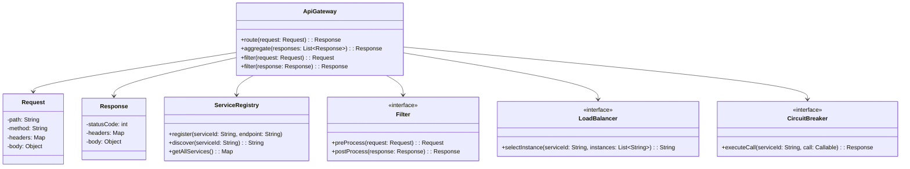

# Padrão Enterprise API Gateway

## Intenção

O padrão API Gateway fornece um ponto de entrada único para um conjunto de microserviços ou APIs, atuando como um
intermediário que roteia requisições, agrega resultados, implementa funcionalidades transversais e simplifica a
interface do cliente.

## Diagrama de Estrutura



## Aplicabilidade

Use o padrão API Gateway quando:

* Precisar expor múltiplos microserviços através de uma única interface
* Quiser implementar funcionalidades transversais centralizadas (autenticação, logging, etc.)
* Necessitar agregar dados de múltiplos serviços para reduzir o número de chamadas do cliente
* Desejar ocultar detalhes de implementação e estrutura interna dos microserviços
* Precisar implementar diferentes interfaces para diferentes clientes (web, mobile, parceiros)

## Responsabilidades Comuns

1. **Roteamento**: Direcionar requisições para o serviço apropriado
2. **Agregação**: Combinar resultados de múltiplos serviços
3. **Transformação**: Converter entre protocolos ou formatos de dados
4. **Funcionalidades Transversais**:
    - Autenticação e autorização
    - Logging e monitoramento
    - Rate limiting
    - Caching
    - Circuit breaking
    - Load balancing

## Consequências

### Vantagens:

* Encapsula a estrutura interna do sistema
* Reduz o número de round-trips entre cliente e servidor
* Centraliza funcionalidades transversais
* Permite evolução independente de serviços backend
* Facilita implementação de diferentes interfaces para diferentes clientes

### Desvantagens:

* Introduz um possível ponto único de falha
* Pode se tornar um gargalo de desempenho se não for dimensionado adequadamente
* Aumenta a complexidade do sistema
* Pode adicionar latência extra nas chamadas

## Implementações Conhecidas

* Netflix Zuul
* Spring Cloud Gateway
* Amazon API Gateway
* Kong
* Azure API Management
* Apigee
* Tyk

## Implementação Sugerida

### Componentes Principais

#### ApiGateway

```java
public interface ApiGateway {
    Response route(Request request);

    Response aggregate(String[] serviceIds, Request request);

    void addFilter(Filter filter);

    void setLoadBalancer(LoadBalancer loadBalancer);

    void setCircuitBreaker(CircuitBreaker circuitBreaker);
}
```

#### Request/Response

Classes para representar requisições e respostas HTTP.

#### ServiceRegistry

```java
public interface ServiceRegistry {
    void register(String serviceId, String endpoint);

    void deregister(String serviceId, String endpoint);

    String discover(String serviceId);

    List<String> getAllInstances(String serviceId);

    Map<String, List<String>> getAllServices();
}
```

#### Filter

```java
public interface Filter {
    Request preProcess(Request request);

    Response postProcess(Response response);

    int getOrder();
}
```

### Classes de Suporte

#### RequestRouter

Responsável por determinar o serviço de destino com base nos dados da requisição.

#### ResponseAggregator

Combina resultados de múltiplas chamadas a serviços em uma única resposta.

### Exemplo de Uso

Implementar um API Gateway para uma aplicação de e-commerce onde:

- Serviços: catálogo de produtos, carrinho de compras, pagamentos, gerenciamento de usuários
- Agregação: combinar detalhes do produto com avaliações em uma única chamada
- Segurança: implementar autenticação JWT centralizada
- Monitoramento: registrar métricas de todas as chamadas para análise

Este padrão é essencial para arquiteturas baseadas em microserviços, simplificando a comunicação entre clientes e o
sistema distribuído.
