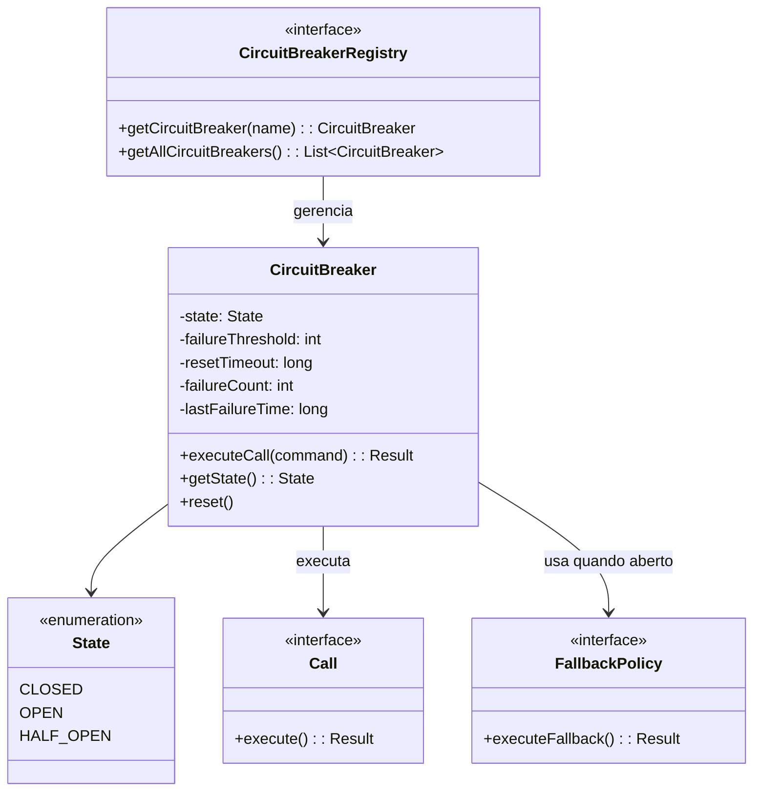

# Padrão Enterprise Circuit Breaker

## Intenção

O padrão Circuit Breaker previne que uma aplicação tente executar repetidamente uma operação que provavelmente falhará,
permitindo que ela continue operando sem esperar que o recurso falho se recupere ou sem gastar recursos de CPU em
chamadas que provavelmente falharão.

## Diagrama de Estrutura



## Aplicabilidade

Use o padrão Circuit Breaker quando:

* Precisar se comunicar com serviços externos sujeitos a falhas
* Quiser evitar sobrecarregar um serviço já com problemas
* Precisar degradar funcionalidades graciosamente durante falhas
* Quiser implementar mecanismos de recuperação automática
* Precisar implementar resiliência em sistemas distribuídos

## Estados do Circuit Breaker

1. **Fechado (Closed)**: Estado normal, as requisições são encaminhadas ao serviço normalmente. Falhas são contadas.
2. **Aberto (Open)**: Quando o número de falhas excede um limite, o circuit breaker "abre" e todas as requisições falham
   rapidamente (fail-fast) ou retornam um fallback.
3. **Semi-aberto (Half-Open)**: Após um período de timeout, o circuit breaker permite que algumas requisições passem
   para testar se o serviço se recuperou.

## Consequências

### Vantagens:

* Falha rápida (fail-fast) em vez de esperar timeouts
* Recuperação automática através do estado semi-aberto
* Reduz a carga em serviços já sobrecarregados
* Aumenta a resiliência de sistemas distribuídos
* Melhora a experiência do usuário durante falhas parciais

### Desvantagens:

* Adiciona complexidade ao sistema
* Requer configuração cuidadosa de limites e timeouts
* Pode ser difícil testar todas as condições
* Potencial para comportamentos inesperados durante transições de estado

## Implementações Conhecidas

* Resilience4j
* Hystrix (descontinuado, mas influente)
* Spring Cloud Circuit Breaker
* Microprofile Fault Tolerance
* Polly (.NET)

## Implementação Sugerida

### Componentes Principais

#### CircuitBreaker

```java
public interface CircuitBreaker {
    <T> T executeCall(Callable<T> call) throws Exception;

    <T> T executeCall(Callable<T> call, Function<Exception, T> fallback);

    State getState();

    CircuitBreakerMetrics getMetrics();

    void reset();
}
```

#### State

```java
public enum State {
    CLOSED,
    OPEN,
    HALF_OPEN
}
```

#### CircuitBreakerConfig

```java
public interface CircuitBreakerConfig {
    int getFailureThreshold();

    long getResetTimeoutMs();

    int getSuccessThreshold();

    List<Class<? extends Exception>> getRecordedExceptions();

    List<Class<? extends Exception>> getIgnoredExceptions();
}
```

#### CircuitBreakerMetrics

```java
public interface CircuitBreakerMetrics {
    int getFailureCount();

    int getSuccessCount();

    long getLastFailureTime();

    float getFailureRate();

    int getNumberOfBufferedCalls();
}
```

### Classes de Suporte

#### CircuitBreakerRegistry

Registro centralizado para gerenciar múltiplas instâncias de circuit breakers.

#### CircuitBreakerEventListener

Interface para notificação de eventos do circuit breaker (abertura, fechamento, etc).

### Exemplo de Uso

Implementar um sistema de comunicação com APIs externas onde:

- Serviços: API de pagamento, API de estoque, API de envio
- Configuração: Limiares diferentes para cada serviço
- Fallbacks: Respostas padrão quando um serviço está indisponível
- Monitoramento: Dashboard para visualizar o estado de cada circuit breaker

Este padrão é essencial para construir sistemas distribuídos resilientes que podem lidar com falhas em dependências
externas de forma elegante.
