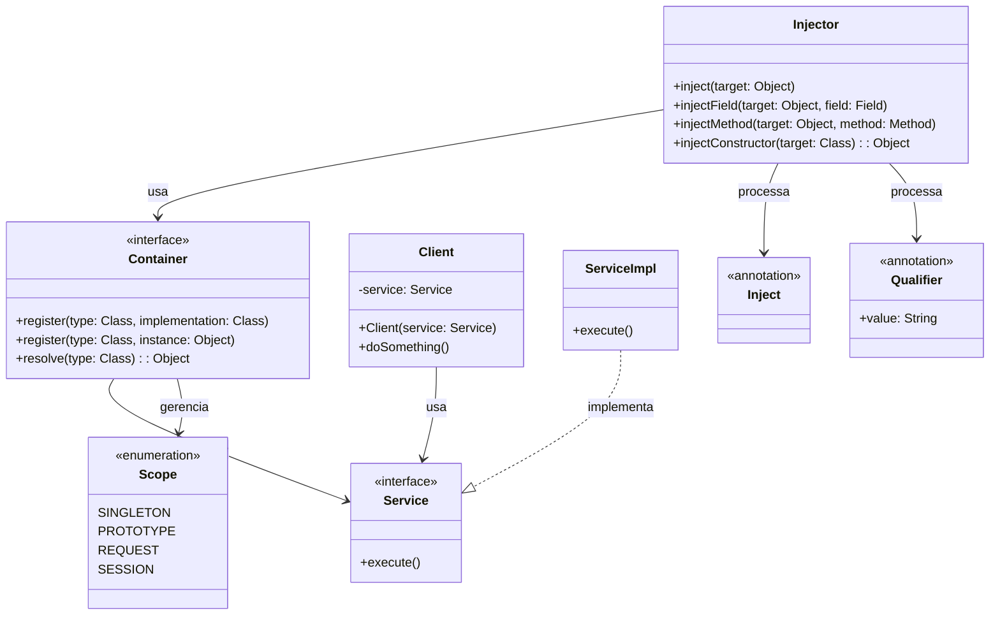

# Padrão Enterprise Dependency Injection

## Intenção

O padrão Dependency Injection é uma técnica onde um objeto recebe outros objetos dos quais depende (suas dependências)
em vez de criá-los internamente. Isso aumenta a modularidade, facilita testes unitários e reduz o acoplamento entre
componentes.

## Diagrama de Estrutura



## Tipos de Injeção

### 1. Injeção por Construtor

- Dependências são fornecidas através de parâmetros do construtor
- Garante inicialização completa de objetos
- Torna dependências explícitas e obrigatórias

### 2. Injeção por Setter

- Dependências são fornecidas através de métodos setter
- Permite injeção opcional e substituição de dependências
- Permite injeção circular (com cuidado)

### 3. Injeção por Campo

- Dependências são injetadas diretamente nos campos
- Simplifica o código, mas dificulta testes
- Oculta dependências da API pública

### 4. Injeção por Interface

- Componente implementa interface que expõe setters para injeção
- Menos comum, mas torna a injeção parte do contrato

## Aplicabilidade

Use o padrão Dependency Injection quando:

* Deseja desacoplar componentes
* Precisa facilitar testes unitários com mocks
* Quer centralizar a configuração de dependências
* Precisa alternar implementações sem modificar o código cliente
* Deseja aplicar Inversão de Controle (IoC)

## Consequências

### Vantagens:

* Reduz acoplamento entre componentes
* Facilita testes unitários através de mocks
* Permite configuração centralizada
* Simplifica troca de implementações
* Promove programação para interfaces

### Desvantagens:

* Pode introduzir complexidade adicional
* Rastreamento de dependências mais difícil
* Maior curva de aprendizado
* Possível impacto no desempenho
* Debugging potencialmente mais complexo

## Implementações Conhecidas

* Spring Framework
* Google Guice
* Java CDI (Contexts and Dependency Injection)
* Dagger
* Jakarta EE
* Micronaut
* Quarkus

## Implementação Sugerida

### Componentes Principais

#### Container

```java
public interface Container {
    <T> void register(Class<T> type, Class<? extends T> implementation);

    <T> void register(Class<T> type, T instance);

    <T> void register(Class<T> type, Provider<T> provider);

    <T> T resolve(Class<T> type);

    <T> T resolve(Class<T> type, String qualifier);
}
```

#### Injector

```java
public interface Injector {
    void inject(Object target);

    <T> T createInstance(Class<T> type);
}
```

#### Provider

```java
public interface Provider<T> {
    T get();
}
```

### Anotações

#### Inject

```java

@Retention(RetentionPolicy.RUNTIME)
@Target({ElementType.CONSTRUCTOR, ElementType.METHOD, ElementType.FIELD})
public @interface Inject {
}
```

#### Qualifier

```java

@Retention(RetentionPolicy.RUNTIME)
@Target({ElementType.PARAMETER, ElementType.FIELD, ElementType.METHOD})
public @interface Qualifier {
    String value();
}
```

### Exemplo de Uso

Implementar um sistema de processamento de pedidos onde:

- Serviços: OrderService, PaymentService, InventoryService, ShippingService
- Repositórios: OrderRepository, CustomerRepository
- Configuração: Diferentes implementações para ambiente de desenvolvimento, teste e produção
- Injeção: Uso de construtores para dependências obrigatórias e setters para opcionais

Este padrão é fundamental para arquiteturas modernas baseadas em componentes, permitindo sistemas flexíveis, testáveis e
de baixo acoplamento.
