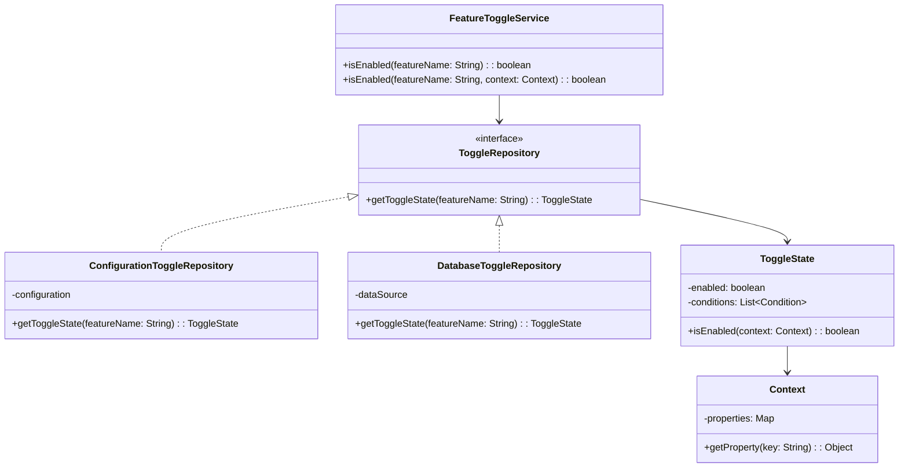

# Padrão Enterprise Feature Toggle/Feature Flag

## Intenção

O padrão Feature Toggle (também conhecido como Feature Flag) permite habilitar ou desabilitar funcionalidades
específicas em tempo de execução, sem necessidade de reimplantar o código. Isso facilita testes A/B, lançamentos
graduais, desenvolvimento baseado em trunk e mitigação de riscos.

## Diagrama de Estrutura



## Aplicabilidade

Use o padrão Feature Toggle quando:

* Precisa controlar o acesso a funcionalidades em produção
* Deseja realizar implantações contínuas e integração contínua
* Precisa realizar testes A/B ou lançamentos graduais
* Deseja mitigar riscos em novos recursos
* Precisa personalizar funcionalidades para diferentes segmentos de usuários

## Consequências

### Vantagens:

* Separação entre implantação e ativação de recursos
* Capacidade de lançar recursos gradualmente
* Facilita testes em produção e experimentos
* Permite desativar recursos problemáticos rapidamente
* Suporta segmentação e personalização

### Desvantagens:

* Aumento da complexidade do código
* Potencial para dívida técnica se toggles não forem removidos
* Necessidade de teste de todas as combinações de toggles
* Possível impacto no desempenho
* Requer infraestrutura adicional para gerenciamento

## Implementações Conhecidas

* Bibliotecas Java: FF4J, Togglz, LaunchDarkly
* Spring Boot com @ConditionalOnProperty
* Ferramentas empresariais: Split.io, Optimizely, Flagsmith
* Implementações personalizadas com base em configurações ou bancos de dados

## Implementação Sugerida

### Componentes Principais

#### FeatureToggle

```java
public interface FeatureToggle {
    boolean isEnabled(String featureName);

    boolean isEnabled(String featureName, Context context);
}
```

#### Context

```java
public interface Context {
    <T> T getValue(String key);

    boolean hasKey(String key);

    Map<String, Object> getAllValues();
}
```

#### ToggleRepository

```java
public interface ToggleRepository {
    boolean getToggleState(String featureName);

    boolean getToggleState(String featureName, Context context);

    void setToggleState(String featureName, boolean enabled);
}
```

### Classes de Suporte

#### FeatureManager

Gerencia os feature toggles e provê métodos para atualização em tempo de execução.

#### ToggleRouter

Direciona o fluxo de execução com base no estado dos toggles.

### Exemplo de Uso

Implementar um sistema de lançamento gradual de funcionalidades onde:

- Features: Novo layout, sistema de recomendação, modo dark
- Critérios: Percentual de usuários, grupo de teste, localização geográfica
- Dashboard: Interface de administração para habilitar/desabilitar features

Este padrão é essencial para estratégias de desenvolvimento contínuo, testes A/B e mitigação de riscos em novas
funcionalidades.
