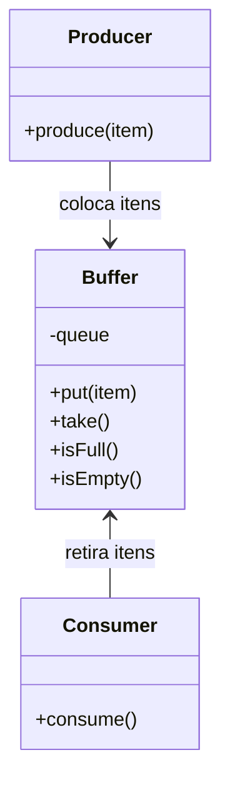

# Padrão Enterprise Producer-Consumer

## Intenção

O padrão Producer-Consumer estabelece um mecanismo para transferir dados entre dois componentes de software, onde um
componente (produtor) gera dados que são consumidos por outro componente (consumidor), geralmente utilizando uma
estrutura de buffer para armazenar temporariamente os dados.

## Diagrama de Estrutura



## Aplicabilidade

Use o padrão Producer-Consumer quando:

* Precisa processar tarefas de forma assíncrona
* Existem componentes com velocidades de processamento diferentes
* Deseja balancear carga entre threads
* Precisa implementar filas de processamento de tarefas

## Consequências

### Vantagens:

* Desacoplamento entre produtor e consumidor
* Controle de fluxo e balanceamento de carga
* Paralelismo e escalabilidade
* Gerenciamento de picos de processamento

### Desvantagens:

* Complexidade adicional
* Possíveis problemas de sincronização
* Potencial para deadlocks ou starvation
* Overhead de memória para o buffer

## Implementações Conhecidas

* Java: BlockingQueue, ThreadPoolExecutor
* Sistemas de mensageria: Apache Kafka, RabbitMQ
* Frameworks de processamento distribuído: Apache Spark

## Implementação Sugerida

### Componentes Principais

#### Buffer

```java
public interface Buffer<T> {
    void put(T item) throws InterruptedException;

    T take() throws InterruptedException;

    boolean isEmpty();

    boolean isFull();
}
```

#### Producer

```java
public interface Producer<T> {
    void produce(Buffer<T> buffer) throws InterruptedException;
}
```

#### Consumer

```java
public interface Consumer<T> {
    void consume(Buffer<T> buffer) throws InterruptedException;
}
```

### Classes de Suporte

#### BufferManager

Responsável por gerenciar o buffer compartilhado entre produtores e consumidores.

#### WorkerManager

Coordena a execução de múltiplos produtores e consumidores.

### Exemplo de Uso

Implementar um sistema de processamento de pedidos onde:

- Produtores: Recebem pedidos de diferentes canais (web, mobile, API)
- Buffer: Fila de pedidos pendentes com capacidade limitada
- Consumidores: Processadores que tratam os pedidos e atualizam o status

Este padrão é especialmente útil em situações onde há necessidade de processamento assíncrono e balanceamento de carga
entre componentes com velocidades diferentes.
