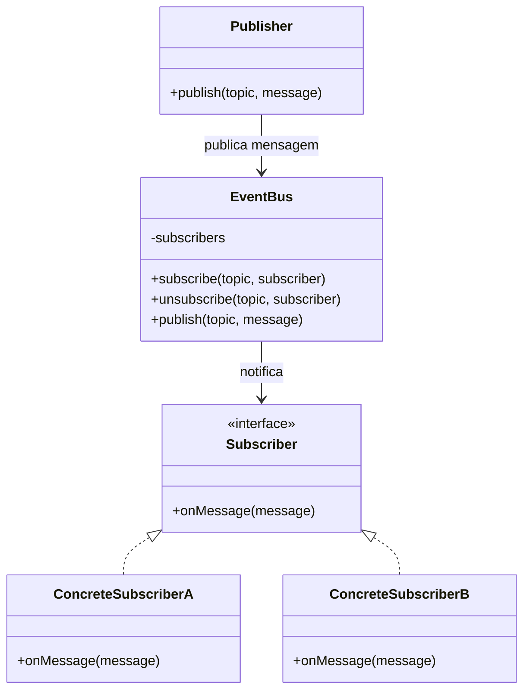

# Padrão Enterprise Pub-Sub (Publicador-Assinante)

## Intenção

O padrão Pub-Sub (Publicador-Assinante) permite que componentes de software se comuniquem de forma assíncrona e
desacoplada, onde os remetentes de mensagens (publicadores) não enviam diretamente para destinatários específicos (
assinantes), mas categorizam as mensagens em tópicos aos quais os assinantes podem se inscrever.

## Diagrama de Estrutura



## Participantes

- **Publisher (Publicador)**: Publica mensagens em tópicos específicos sem conhecer quem as receberá
- **EventBus (Barramento de Eventos)**: Gerencia tópicos e assinantes, roteia mensagens dos publicadores para os
  assinantes apropriados
- **Subscriber (Assinante)**: Interface que define como os assinantes receberão as mensagens
- **ConcreteSubscriber (Assinante Concreto)**: Implementação de assinantes que processam as mensagens recebidas

## Como Funciona

1. Os assinantes registram seu interesse em tópicos específicos no barramento de eventos
2. Quando um publicador envia uma mensagem para um tópico, o barramento de eventos identifica todos os assinantes desse
   tópico
3. O barramento de eventos entrega a mensagem a cada assinante (geralmente de forma assíncrona)
4. Os assinantes processam a mensagem conforme necessário
5. A comunicação é totalmente desacoplada - publicadores não conhecem os assinantes e vice-versa

## Exemplo Prático: Sistema de Notificações de E-commerce

Imagine um sistema de e-commerce onde diferentes eventos (como novas compras, alterações de status de pedido,
atualizações de estoque) precisam ser comunicados a vários serviços (como faturamento, entrega, marketing, etc.).

### Estrutura para o Sistema de Notificações

- **OrderService, InventoryService, etc.** (Publicadores): Serviços que geram eventos
- **EventBusService** (Barramento de Eventos): Gerencia tópicos e assinantes
- **BillingService, ShippingService, NotificationService, etc.** (Assinantes): Serviços que precisam reagir a eventos
  específicos

## Considerações de Implementação

1. **Gerenciamento de Tópicos**:
    - Hierarquia de tópicos para facilitar assinaturas mais granulares
    - Tópicos dinâmicos vs. tópicos pré-definidos
    - Filtros de mensagens para assinantes

2. **Garantias de Entrega**:
    - Entrega pelo menos uma vez vs. no máximo uma vez vs. exatamente uma vez
    - Persistência de mensagens para recuperação de falhas
    - Confirmações de recebimento (ACKs)

3. **Escalabilidade**:
    - Balanceamento de carga entre múltiplas instâncias de assinantes
    - Particionamento de tópicos para paralelização
    - Buffering para lidar com picos de tráfego

4. **Monitoramento e Rastreamento**:
    - Rastreamento de mensagens através do sistema
    - Métricas de desempenho e latência
    - Alertas para falhas de entrega

## Benefícios

- Desacoplamento total entre publicadores e assinantes
- Facilidade para adicionar novos assinantes sem modificar publicadores
- Comunicação assíncrona que aumenta a resiliência do sistema
- Escalabilidade através de processamento paralelo
- Flexibilidade para evoluir componentes independentemente

## Desvantagens

- Complexidade adicional na arquitetura
- Potenciais desafios de depuração em fluxos assíncronos
- Possíveis problemas de consistência devido à natureza assíncrona
- Overhead de performance comparado à comunicação direta
- Garantias de entrega podem ser complexas de implementar

## Padrões Relacionados

- **Observer**: Similar, mas geralmente em um único processo com acoplamento mais forte
- **Mediator**: Centraliza a comunicação, mas com conhecimento direto entre componentes
- **Message Queue**: Frequentemente utilizado para implementar sistemas Pub-Sub
- **Event Sourcing**: Pode usar Pub-Sub para propagar eventos de mudança de estado

## Implementação Sugerida

### Componentes Principais

#### Publisher

```java
public interface Publisher {
    void publish(String topic, Message message);
}
```

#### Subscriber

```java
public interface Subscriber {
    void onMessage(String topic, Message message);
}
```

#### EventBus

```java
public interface EventBus {
    void subscribe(String topic, Subscriber subscriber);

    void unsubscribe(String topic, Subscriber subscriber);

    void publish(String topic, Message message);
}
```

#### Message

```java
public class Message {
    private String id;
    private Object payload;
    private Map<String, Object> headers;

    // Construtores, getters e setters
}
```

### Classes de Suporte

#### TopicManager

Gerencia os tópicos disponíveis e suas configurações.

#### SubscriptionRegistry

Mantém o registro de todos os assinantes por tópico.

### Exemplo de Uso

Implementar um sistema de notificações em tempo real onde:

- Publishers: Serviços que geram eventos (pedidos, pagamentos, envios)
- Tópicos: Categorias de eventos (novo-pedido, pagamento-confirmado, pedido-enviado)
- Subscribers: Componentes interessados em determinados eventos (email, push, analytics)

Este padrão é ideal para implementar comunicação assíncrona entre componentes desacoplados em sistemas distribuídos.
