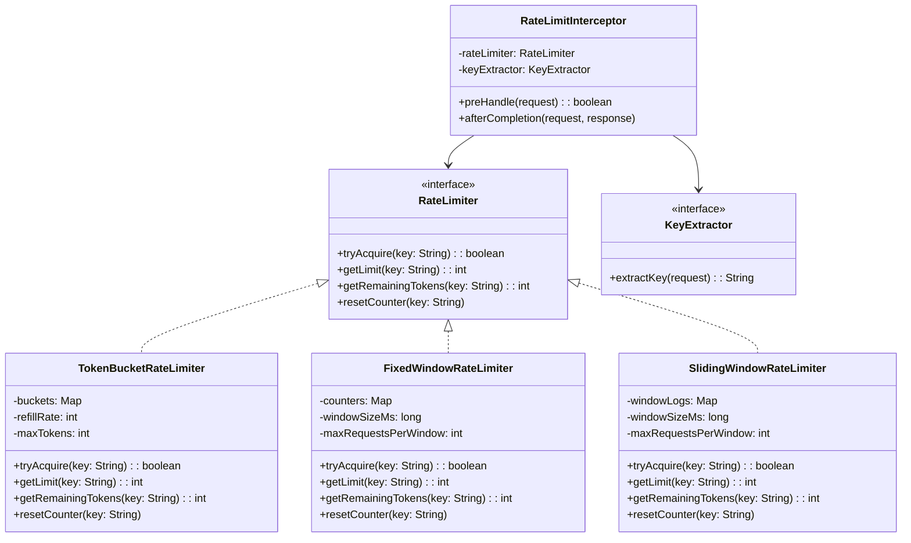

# Padrão Enterprise Rate Limiting

## Intenção

O padrão Rate Limiting controla a taxa de solicitações que um cliente pode fazer a um sistema ou API, protegendo
recursos contra sobrecarga, ataques de negação de serviço (DoS) e uso abusivo. Ele estabelece limites de requisições por
período de tempo, garantindo que o sistema permaneça disponível e responsivo para todos os usuários.

## Diagrama de Estrutura



## Aplicabilidade

Use o padrão Rate Limiting quando:

* Precisa proteger APIs e serviços contra sobrecarga
* Deseja implementar cotas de uso para diferentes tipos de usuários
* Precisa se defender contra ataques de negação de serviço (DoS)
* Deseja garantir qualidade de serviço para todos os usuários
* Precisa implementar uma estratégia de degradação elegante sob carga

## Consequências

### Vantagens:

* Proteção contra abusos e ataques de negação de serviço
* Alocação justa de recursos entre múltiplos clientes
* Prevenção de sobrecarga do sistema
* Possibilidade de implementar diferentes níveis de serviço
* Melhoria da confiabilidade e disponibilidade do sistema

### Desvantagens:

* Complexidade adicional na implementação
* Potencial impacto na experiência do usuário quando limites são atingidos
* Desafios em ambientes distribuídos para sincronização de contadores
* Necessidade de calibrar adequadamente os limites
* Overhead de processamento e armazenamento para rastrear requisições

## Implementações Conhecidas

* Java: Resilience4j, Bucket4j, Guava RateLimiter
* Spring Cloud Gateway com filtros de rate limiting
* API Gateways: Amazon API Gateway, Kong, Apigee
* Redis como armazenamento distribuído para rate limiting
* Bibliotecas específicas para microserviços como Istio e Envoy

## Implementação Sugerida

### Componentes Principais

#### RateLimiter

```java
public interface RateLimiter {
    boolean tryAcquire(String key);

    int getRemainingTokens(String key);

    int getLimit(String key);

    void resetLimit(String key);
}
```

#### RateLimitAlgorithm

```java
public interface RateLimitAlgorithm {
    boolean tryConsume(String key, int tokens);

    int getRemainingTokens(String key);

    void refill(String key);
}
```

#### KeyExtractor

```java
public interface KeyExtractor {
    String extractKey(HttpRequest request);
}
```

### Classes de Suporte

#### RateLimitingInterceptor

Intercepta solicitações e aplica limites com base em políticas configuradas.

#### LimitExceededHandler

Define o comportamento quando os limites são excedidos (retry, reject, throttle).

### Exemplo de Uso

Implementar um sistema de proteção de API onde:

- Limites: 100 requisições por minuto para usuários anônimos, 1000 para usuários autenticados
- Chaves: IP para usuários anônimos, ID do usuário para autenticados
- Comportamento: HTTP 429 (Too Many Requests) com Retry-After header quando excedido

Este padrão é essencial para proteger APIs públicas, garantir qualidade de serviço e prevenir abusos ou ataques de
negação de serviço.
