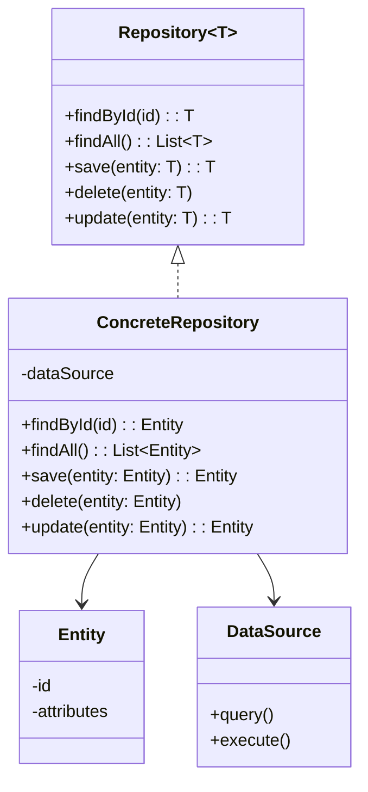

# Padrão Enterprise Repository

## Intenção

O padrão Repository atua como uma camada de abstração entre a lógica de negócios e a camada de acesso a dados,
encapsulando a lógica necessária para acessar fontes de dados. Ele fornece uma API mais orientada a objetos para
persistência de dados, isolando o domínio do modelo das implementações de acesso a dados.

## Diagrama de Estrutura



## Aplicabilidade

Use o padrão Repository quando:

* Deseja centralizar a lógica de acesso a dados
* Precisa abstrair a lógica de persistência
* Deseja facilitar a testabilidade substituindo a fonte de dados real por mocks
* Precisa implementar regras de negócio independentes da tecnologia de armazenamento
* Deseja melhorar a manutenibilidade e evitar duplicação de código de acesso a dados

## Consequências

### Vantagens:

* Separa a lógica de negócio do acesso a dados
* Facilita testes unitários e de integração
* Promove reusabilidade de código
* Permite mudanças na tecnologia de persistência com impacto mínimo
* Organiza o código de acesso a dados

### Desvantagens:

* Adiciona uma camada extra à aplicação
* Pode resultar em overhead para aplicações simples
* Pode levar a problemas de desempenho se mal implementado

## Implementações Conhecidas

* Spring Data JPA
* Hibernate com padrão DAO
* Entity Framework no .NET
* Arquitetura em aplicações DDD (Domain-Driven Design)

## Implementação Sugerida

### Componentes Principais

#### Repository

```java
public interface Repository<T, ID> {
    Optional<T> findById(ID id);

    List<T> findAll();

    List<T> findByCondition(Specification<T> specification);

    T save(T entity);

    void delete(T entity);

    void deleteById(ID id);
}
```

#### Entity

Interface ou classe abstrata que representa entidades persistíveis.

```java
public interface Entity<ID> {
    ID getId();

    void setId(ID id);
}
```

#### DataMapper

```java
public interface DataMapper<T, DTO> {
    DTO toDto(T entity);

    T toEntity(DTO dto);

    List<DTO> toDtoList(List<T> entities);

    List<T> toEntityList(List<DTO> dtos);
}
```

### Classes de Suporte

#### RepositoryFactory

Fábrica para criar diferentes tipos de repositórios.

#### UnitOfWork

Gerencia transações e sincronização de operações em múltiplos repositórios.

### Exemplo de Uso

Implementar um sistema de gerenciamento de produtos onde:

- Entidades: Product, Category, Supplier
- Repositórios: ProductRepository, CategoryRepository, SupplierRepository
- Armazenamento: Implementações para JPA, MongoDB e em memória

Este padrão é fundamental para aplicações empresariais que precisam acessar dados de múltiplas fontes de forma
consistente e testável.
