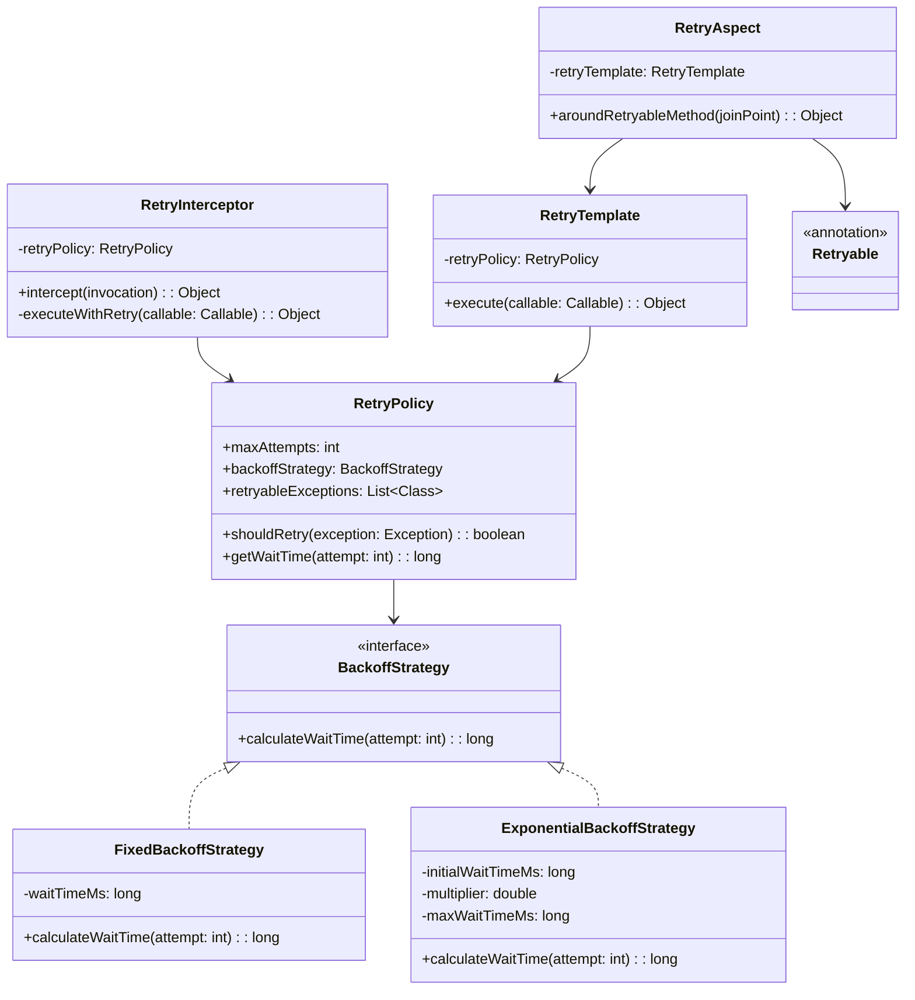

# Padrão Enterprise Retry Pattern com Interceptor

## Intenção

O padrão Retry Pattern com Interceptor permite que uma aplicação lide com falhas temporárias na comunicação com serviços
externos ou recursos, tentando automaticamente a operação novamente após um período de espera. A implementação com
interceptores permite que essa lógica seja aplicada de forma transparente, sem alterar o código de negócio.

## Diagrama de Estrutura



## Aplicabilidade

Use o padrão Retry Pattern com Interceptor quando:

* Interage com serviços externos sujeitos a falhas temporárias
* Trabalha com comunicação de rede que pode sofrer interrupções momentâneas
* Precisa implementar resiliência em operações de I/O
* Deseja separar a lógica de retentativa do código de negócio
* Utiliza microserviços ou arquiteturas distribuídas

## Consequências

### Vantagens:

* Aumento da resiliência da aplicação
* Separação clara entre código de negócio e lógica de retentativa
* Configuração flexível de políticas de retry
* Aplicação transparente através de aspectos ou interceptores
* Possibilidade de implementar diferentes estratégias de backoff

### Desvantagens:

* Potencial aumento no tempo de resposta
* Complexidade adicional no código
* Risco de sobrecarregar recursos se não configurado adequadamente
* Dificuldade em distinguir falhas transitórias de falhas permanentes
* Possibilidade de efeitos cascata em sistemas distribuídos

## Implementações Conhecidas

* Java: Spring Retry, Resilience4j, Hystrix
* Interceptores HTTP: OkHttp, Retrofit
* Aspectos em Spring com anotações @Retryable
* Frameworks de mensageria com políticas de reentrega
* AWS SDK com retentativas automáticas configuráveis

## Implementação Sugerida

### Componentes Principais

#### RetryPolicy

```java
public interface RetryPolicy {
    boolean shouldRetry(Exception exception, int attempt);

    long getWaitTime(int attempt);

    int getMaxAttempts();
}
```

#### BackoffStrategy

```java
public interface BackoffStrategy {
    long calculateWaitTime(int attempt);
}
```

#### RetryTemplate

```java
public interface RetryTemplate {
    <T> T execute(Callable<T> task) throws Exception;

    <T> T execute(Callable<T> task, RetryPolicy retryPolicy) throws Exception;
}
```

#### Retryable

```java

@Retention(RetentionPolicy.RUNTIME)
@Target(ElementType.METHOD)
public @interface Retryable {
    Class<? extends Throwable>[] retryFor() default {Exception.class};

    Class<? extends Throwable>[] noRetryFor() default {};

    int maxAttempts() default 3;

    String backoffStrategy() default "fixed";

    long initialInterval() default 1000L;

    double multiplier() default 2.0;

    long maxInterval() default 30000L;
}
```

### Classes de Suporte

#### RetryAspect

Aspecto que intercepta métodos anotados com @Retryable e aplica a lógica de retry.

#### RetryInterceptor

Interceptador para aplicar retry em chamadas remotas ou operações específicas.

### Exemplo de Uso

Implementar um sistema resiliente para comunicação com serviços externos onde:

- Operações: Chamadas REST para APIs de terceiros, acesso a bancos de dados
- Políticas: Backoff exponencial para APIs externas, retry fixo para banco de dados
- Exceções: Retry para problemas de conectividade, mas não para erros de autenticação

Este padrão é fundamental para criar sistemas distribuídos resilientes que podem lidar com falhas transitórias comuns em
ambientes de rede.
