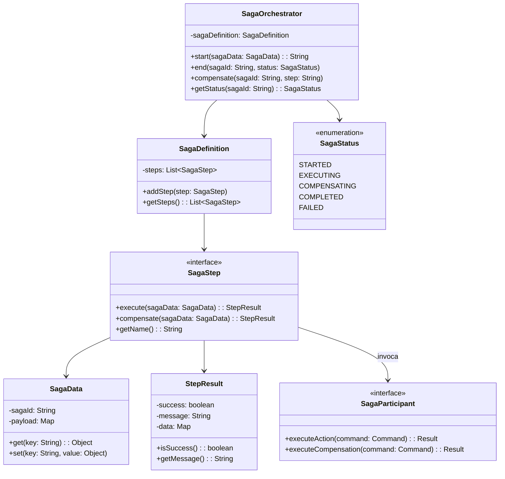

# Padrão Enterprise Saga

## Intenção

O padrão Saga gerencia transações distribuídas em arquiteturas de microsserviços, garantindo consistência eventual entre
múltiplos serviços através de uma sequência de transações locais, onde cada transação local atualiza o banco de dados e
publica um evento/mensagem para acionar a próxima transação local.

## Diagrama de Estrutura



## Tipos de Sagas

### 1. Saga Orquestrada (Orchestration-based)

- Um serviço central (orquestrador) determina quais serviços executar e quando
- Gerencia todo o fluxo da transação distribuída
- Coordena compensações em caso de falha
- Mais centralizada e com maior controle

### 2. Saga Coreografada (Choreography-based)

- Cada serviço produz e escuta eventos sem um coordenador central
- Cada serviço sabe quais eventos ouvir e quais eventos emitir
- A sequência é determinada pela reação aos eventos
- Mais desacoplada, mas potencialmente mais difícil de rastrear

## Aplicabilidade

Use o padrão Saga quando:

* Precisar manter consistência entre múltiplos microserviços
* Transações ACID tradicionais não forem viáveis devido à distribuição
* Precisar gerenciar operações de longa duração
* Quiser implementar fluxos de trabalho que atravessem limites de serviços
* Desejar garantir compensação adequada em caso de falhas

## Consequências

### Vantagens:

* Possibilita transações distribuídas em arquiteturas de microserviços
* Mantém a autonomia dos serviços
* Permite escalabilidade horizontal dos componentes
* Oferece resiliência através de mecanismos de compensação
* Suporta transações de longa duração

### Desvantagens:

* Complexidade de implementação e manutenção
* Apenas consistência eventual (não ACID)
* Rastreamento e debugging mais difíceis
* Necessidade de projetar cuidadosamente as compensações
* Possibilidade de resultados parciais visíveis durante a execução

## Implementações Conhecidas

* Axon Framework
* Eventuate Tram Saga
* Apache Camel Saga
* MicroProfile LRA (Long Running Actions)
* Zeebe
* NServiceBus Sagas

## Implementação Sugerida

### Componentes Principais

#### SagaOrchestrator

```java
public interface SagaOrchestrator {
    String start(SagaData sagaData);

    void end(String sagaId, SagaStatus status);

    void compensate(String sagaId, String step);

    SagaStatus getStatus(String sagaId);

    void registerSagaDefinition(String sagaType, SagaDefinition sagaDefinition);
}
```

#### SagaStep

```java
public interface SagaStep {
    StepResult execute(SagaData sagaData);

    StepResult compensate(SagaData sagaData);

    String getName();

    int getOrder();
}
```

#### SagaData

```java
public interface SagaData {
    String getSagaId();

    <T> T get(String key);

    void set(String key, Object value);

    Map<String, Object> getAll();
}
```

### Classes de Suporte

#### SagaRepository

Armazena e recupera o estado das sagas.

#### SagaEventHandler

Processa eventos relacionados às sagas.

### Exemplo de Uso

Implementar um processo de pedido em um e-commerce onde:

- Serviços: gestão de pedidos, pagamentos, estoque, entrega
- Fluxo: criar pedido → reservar estoque → processar pagamento → preparar entrega
- Compensações: estornar pagamento, liberar estoque, cancelar pedido
- Persistência: armazenar estado da saga para recuperação em caso de falhas

Este padrão é essencial para manter a consistência de dados em sistemas distribuídos sem usar transações distribuídas
tradicionais.
