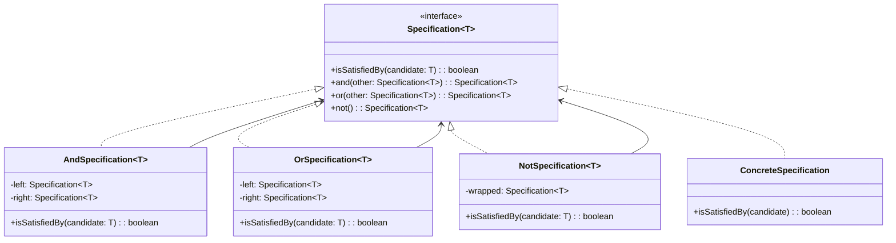

# Padrão Enterprise Specification

## Intenção

O padrão Specification encapsula regras de negócio em objetos separados, permitindo a combinação de regras através de
operações lógicas (AND, OR, NOT) e abstraindo a lógica de seleção e filtragem de entidades. Esse padrão é frequentemente
usado em arquiteturas orientadas a domínio (DDD).

## Diagrama de Estrutura



## Aplicabilidade

Use o padrão Specification quando:

* Precisa encapsular regras de negócio complexas
* Deseja combinar regras de negócio de forma flexível
* Precisa aplicar filtros complexos a coleções de objetos
* Deseja construir consultas dinâmicas baseadas em critérios
* Trabalha com Domain-Driven Design (DDD)

## Consequências

### Vantagens:

* Encapsulamento de regras de negócio
* Reutilização de critérios de seleção
* Composição de regras através de operadores lógicos
* Melhora da legibilidade do código de negócios
* Separação de responsabilidades

### Desvantagens:

* Pode adicionar complexidade a aplicações simples
* Curva de aprendizado inicial
* Possível impacto no desempenho se mal implementado

## Implementações Conhecidas

* Java Specification Pattern em aplicações Spring
* Critérios de seleção em ORMs como Hibernate e JPA
* Bibliotecas como QueryDSL e Specifications-Arg-Resolver
* Entity Framework (LINQ expressions) no .NET

## Implementação Sugerida

### Componentes Principais

#### Specification

```java
public interface Specification<T> {
    boolean isSatisfiedBy(T candidate);

    Specification<T> and(Specification<T> other);

    Specification<T> or(Specification<T> other);

    Specification<T> not();
}
```

#### AbstractSpecification

```java
public abstract class AbstractSpecification<T> implements Specification<T> {
    @Override
    public Specification<T> and(Specification<T> other) {
        return new AndSpecification<>(this, other);
    }

    @Override
    public Specification<T> or(Specification<T> other) {
        return new OrSpecification<>(this, other);
    }

    @Override
    public Specification<T> not() {
        return new NotSpecification<>(this);
    }
}
```

#### CompositeSpecification

Implementações para combinações lógicas (And, Or, Not).

### Classes de Suporte

#### SpecificationBuilder

Facilita a criação e composição de especificações.

#### SpecificationExecutor

Interface para executar consultas baseadas em especificações.

### Exemplo de Uso

Implementar um sistema de filtragem de pedidos onde:

- Entidade: Order com atributos como date, status, customer, amount
- Especificações: OrderPaidSpecification, OrderShippedSpecification, OrderBetweenDatesSpecification
- Uso: Filtrar pedidos pagos E enviados OU acima de um determinado valor

Este padrão é especialmente útil para implementar filtros complexos e regras de negócio que podem ser combinadas de
forma flexível em tempo de execução.
