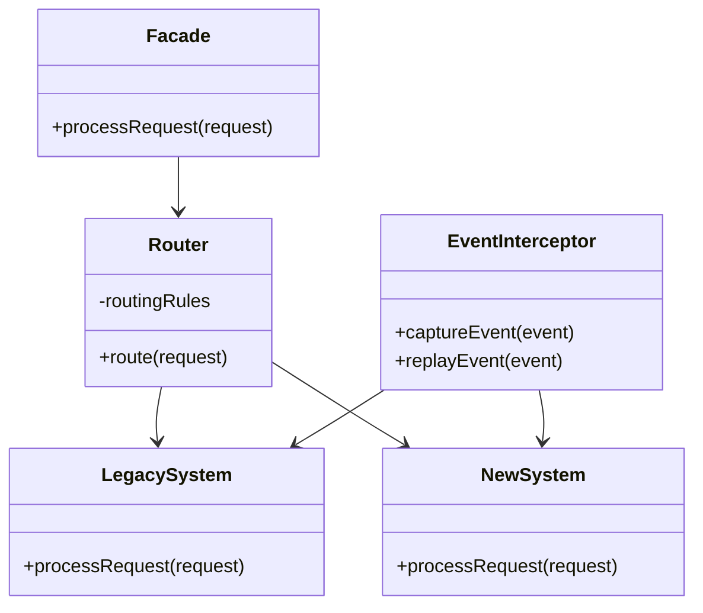

# Padrão Enterprise Strangler Fig

## Intenção

O padrão Strangler Fig (Estrangulador) fornece uma estratégia para transformar incrementalmente um sistema legado,
substituindo gradualmente partes específicas por novas implementações até que o sistema antigo seja completamente
substituído, semelhante a como a figueira estranguladora cresce em torno de uma árvore hospedeira até substituí-la.

## Diagrama de Estrutura



## Aplicabilidade

Use o padrão Strangler Fig quando:

* Precisa migrar gradualmente de um sistema legado para um novo
* O risco de uma substituição completa de uma só vez é muito alto
* Deseja validar novas implementações em produção com tráfego real
* Precisa manter o sistema em funcionamento durante a migração
* Deseja dividir um monolito em microserviços incrementalmente

## Consequências

### Vantagens:

* Redução de riscos através da migração incremental
* Possibilidade de distribuir o trabalho de migração ao longo do tempo
* Validação contínua das novas implementações
* Permite reverter rapidamente para o sistema legado se necessário
* Demonstração de valor mais rápida para stakeholders

### Desvantagens:

* Complexidade adicional durante a fase de transição
* Necessidade de manter sincronizados sistemas novos e antigos
* Potencial para overhead de desempenho devido à camada de fachada
* Pode requerer duplicação temporária de dados e funcionalidades
* Demanda planejamento cuidadoso da estratégia de migração

## Implementações Conhecidas

* Camadas de API Gateway em migrações para microserviços
* Proxy reverso para rotear solicitações entre sistemas
* Migrações graduais de sistemas monolíticos para arquiteturas em nuvem
* Ferramentas como Istio, Kong e outros service meshes para rotear o tráfego
* Projetos de migração em grandes empresas como Amazon, Netflix e Uber

## Implementação Sugerida

### Componentes Principais

#### RequestRouter

```java
public interface RequestRouter {
    boolean shouldRouteToNewSystem(Request request);

    void registerRoute(RouteDefinition routeDefinition);

    void removeRoute(String routeId);
}
```

#### Facade

```java
public interface StranglerFacade {
    Response processRequest(Request request);
}
```

#### SystemAdapter

```java
public interface SystemAdapter {
    Response process(Request request);

    boolean canProcess(Request request);
}
```

### Classes de Suporte

#### MigrationRegistry

Mantém o registro do progresso da migração e configurações de roteamento.

#### FeatureMigrationManager

Gerencia o ciclo de vida da migração de funcionalidades específicas.

### Exemplo de Uso

Implementar a migração de um monolito para microserviços onde:

- Monolito: Sistema legado de e-commerce com todas as funcionalidades
- Novos Microserviços: Catálogo, Pedidos, Pagamentos, Usuários
- Estratégia: Migração gradual iniciando pelo catálogo, seguido de pedidos

Este padrão é fundamental para modernizar sistemas legados de forma controlada e com risco reduzido.
