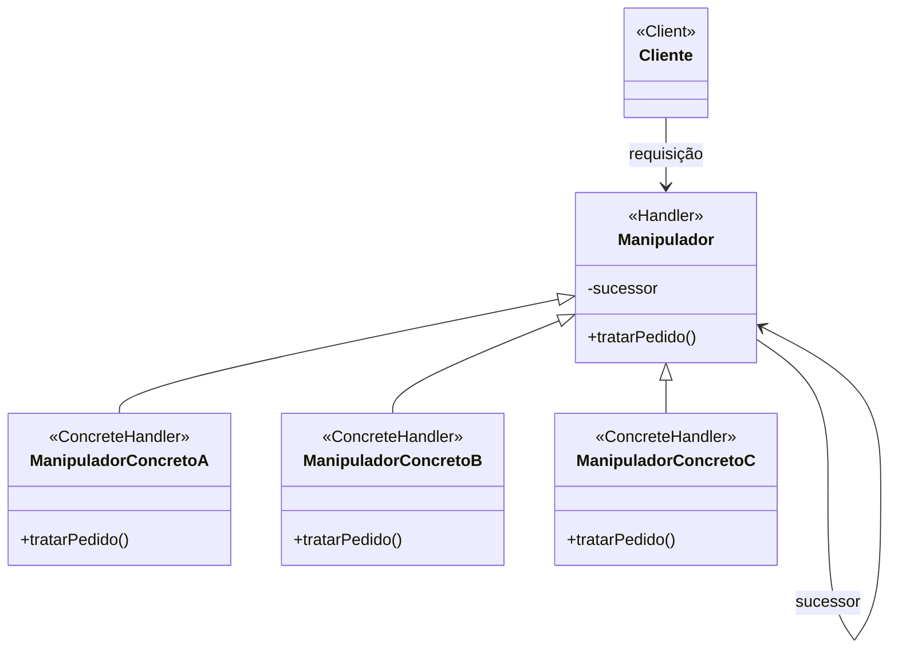

# Padrão de Projeto Cadeia de Responsabilidade (Chain of Responsibility)

## Intenção

O padrão Cadeia de Responsabilidade evita acoplar o remetente de uma solicitação ao seu receptor, dando a mais de um
objeto a chance de tratar a solicitação. Ele encadeia os objetos receptores e passa a solicitação ao longo da cadeia até
que um objeto a trate.

## Diagrama de Estrutura

## Participantes

- **Manipulador (Handler)**: Define uma interface para tratamento de solicitações e opcionalmente implementa o link para
  o sucessor
- **ManipuladorConcreto (ConcreteHandler)**: Trata as solicitações pelas quais é responsável; pode acessar seu sucessor
- **Cliente (Client)**: Inicia a solicitação para um objeto ManipuladorConcreto na cadeia

## Como Funciona

1. O Cliente envia uma solicitação ao primeiro manipulador na cadeia
2. Cada manipulador decide processar a solicitação ou passá-la para o próximo manipulador
3. Isso continua até que um manipulador processe a solicitação ou a cadeia termine
4. A solicitação pode ser parcialmente ou totalmente não tratada se nenhum manipulador puder processá-la

## Exemplo Prático: Sistema de Fluxo de Aprovação

Imagine um sistema de aprovação de despesas onde diferentes valores requerem aprovação de diferentes níveis de gerência.

### Estrutura para o Sistema de Aprovação

- **AprovadorHandler** (Manipulador): Classe abstrata com métodos para definir o próximo manipulador e processar
  solicitações
- **AprovadorLiderEquipe, AprovadorGerente, AprovadorDiretor** (ManipuladoresConcretos): Aprovadores específicos com
  diferentes limites de aprovação
- **SolicitacaoDespesa** (Solicitação): Contém detalhes da despesa como valor, finalidade, etc.

### Fluxo Conceitual

1. Um funcionário submete uma solicitação de despesa
2. A solicitação entra na cadeia de aprovação, começando pelo Líder de Equipe
3. Se o valor estiver dentro do limite de aprovação do Líder de Equipe (ex.: até R$1000), ele aprova
4. Se o valor exceder seu limite, ele passa para o Gerente
5. O Gerente aprova (ex.: até R$5000) ou passa para o Diretor
6. O Diretor pode aprovar valores mais altos (ex.: até R$20000) ou rejeitar a solicitação

### Cenário de Uso

- Um funcionário submete uma solicitação de despesa de R$3500 para participação em conferência
- A solicitação primeiro vai para o Líder de Equipe, que vê que excede seu limite de R$1000
- O Líder de Equipe passa para o Gerente
- O Gerente pode aprovar, já que R$3500 está dentro de seu limite de R$5000
- A solicitação é aprovada sem incomodar o Diretor

## Considerações de Implementação

1. **Construção da Cadeia**:
    - Cadeias podem ser construídas explicitamente pelo cliente ou automaticamente
    - Considere fornecer métodos auxiliares para construir cadeias facilmente

2. **Representação da Solicitação**:
    - Solicitações podem ser parâmetros simples ou objetos complexos
    - Objetos de solicitação ricos fornecem mais informações aos manipuladores

3. **Comportamento do Manipulador**:
    - Manipuladores podem processar a solicitação e depois passá-la adiante (múltiplos manipuladores agem)
    - Manipuladores podem processar a solicitação e parar a cadeia (um manipulador age)
    - Manipuladores podem modificar a solicitação antes de passá-la adiante

4. **Término da Cadeia**:
    - Decida como lidar com solicitações que chegam ao fim da cadeia sem serem processadas
    - Considere um manipulador padrão ou tratamento explícito de erros

## Benefícios

- Reduz o acoplamento entre remetente e receptores
- Adiciona flexibilidade na atribuição de responsabilidades a objetos
- Permite alterar dinamicamente a cadeia em tempo de execução
- Permite adicionar ou remover responsabilidades sem modificar o código existente
- Promove o princípio da responsabilidade única separando a lógica de processamento de solicitações

## Desvantagens

- Sem garantia de que uma solicitação será tratada
- Depuração pode ser desafiadora à medida que a solicitação flui pela cadeia
- Preocupações de desempenho para cadeias longas
- Potencial para problemas de chamadas recursivas se não for implementado cuidadosamente

## Padrões Relacionados

- **Composite**: Cadeia de Responsabilidade é frequentemente aplicada a estruturas Composite
- **Command**: Comandos podem ser passados através de cadeias
- **Decorator**: Ambos os padrões dependem de composição recursiva para organizar um número aberto de objetos
  relacionados
- **Mediator**: Cadeia de Responsabilidade passa uma solicitação ao longo de uma cadeia, enquanto Mediator centraliza o
  controle
