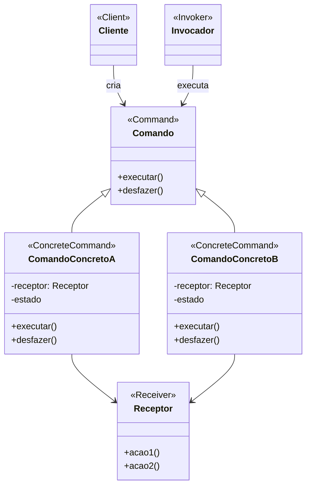

# Padrão de Projeto Comando (Command)

## Intenção

O padrão Comando encapsula uma solicitação como um objeto, permitindo assim a parametrização de clientes com diferentes
solicitações, enfileiramento de solicitações e registro das solicitações. Também permite operações que podem ser
desfeitas.

## Diagrama de Estrutura

## Participantes

- **Comando (Command)**: Declara uma interface para executar uma operação e opcionalmente desfazê-la
- **ComandoConcreto (ConcreteCommand)**: Implementa a interface Comando, definindo uma ligação entre um objeto Receptor
  e uma ação
- **Cliente (Client)**: Cria um objeto ComandoConcreto e define seu receptor
- **Invocador (Invoker)**: Solicita ao comando que execute a requisição
- **Receptor (Receiver)**: Sabe como realizar as operações associadas à execução de uma solicitação

## Como Funciona

1. O Cliente cria um objeto ComandoConcreto e especifica seu Receptor
2. Um objeto Invocador armazena o ComandoConcreto
3. O Invocador emite uma solicitação chamando executar() no Comando
4. O ComandoConcreto executa as operações apropriadas em seu Receptor
5. Para operações que podem ser desfeitas, o ComandoConcreto armazena o estado para reverter seus efeitos e implementa
   um método desfazer

## Exemplo Prático: Editor de Texto

Imagine um aplicativo de editor de texto que suporta operações como inserir, excluir e formatar texto, com
funcionalidade de desfazer/refazer.

### Estrutura para o Editor de Texto

- **ComandoEditorTexto** (Comando): Interface com métodos executar() e desfazer()
- **ComandoInserirTexto, ComandoExcluirTexto, ComandoFormatarTexto** (ComandosConcretos): Implementações para operações
  específicas de texto
- **EditorTexto** (Receptor): Contém os métodos reais de manipulação de texto
- **HistoricoComandos** (Invocador): Gerencia a execução de comandos e mantém histórico para desfazer/refazer
- **Aplicacao** (Cliente): Cria comandos e os associa a botões/itens de menu

### Fluxo Conceitual

1. O usuário clica em um botão para realizar uma ação (por exemplo, excluir texto selecionado)
2. A aplicação cria um ComandoExcluirTexto com o EditorTexto como receptor
3. O comando é passado para o HistoricoComandos, que o executa
4. O ComandoExcluirTexto chama o método apropriado no EditorTexto
5. O comando salva o texto excluído para permitir desfazer
6. Se o usuário clicar em desfazer, o HistoricoComandos recupera e desfaz o último comando

### Cenário de Uso

- O usuário seleciona texto e clica no botão excluir
- O ComandoExcluirTexto é criado com a posição e o conteúdo do texto selecionado
- Quando executado, ele informa ao EditorTexto para excluir o texto
- O comando armazena o texto excluído e sua posição
- Se o usuário clicar em desfazer, o comando restaura o texto excluído

## Considerações de Implementação

1. **Tempo de Execução do Comando**:
    - Comandos podem ser executados imediatamente ou enfileirados para execução posterior
    - Comandos podem ser armazenados no histórico de comandos para desfazer/refazer

2. **Comandos Compostos**:
    - Comandos podem ser compostos para criar macrocomandos que executam múltiplas operações

3. **Implementação de Desfazer**:
    - Baseada em estado: Armazena o estado do objeto antes de executar o comando
    - Baseada em operação: Armazena operações necessárias para reverter o comando

4. **Parametrização de Comando**:
    - Comandos podem ser parametrizados para realizar diferentes operações
    - Parâmetros podem ser passados no momento da criação ou execução

## Benefícios

- Desacopla objetos que invocam operações de objetos que as executam
- Permite criar comandos compostos (macros)
- Facilita adicionar novos comandos sem alterar o código existente
- Suporta operações de desfazer/refazer
- Permite enfileiramento, registro e comportamento transacional

## Desvantagens

- Pode levar a uma proliferação de pequenas classes de comando
- Pode introduzir complexidade quando comandos precisam de estado extensivo para operações de desfazer
- Pode ser excessivo para aplicações simples com poucos comandos

## Padrões Relacionados

- **Composite**: Pode ser usado para implementar macrocomandos
- **Memento**: Frequentemente usado com Comando para manter estado para operações que podem ser desfeitas
- **Prototype**: Comandos podem usar prototype para criar cópias de parâmetros
- **Strategy**: Como Command, parametriza objetos com comportamento, mas normalmente não oferece funcionalidade para
  desfazer
