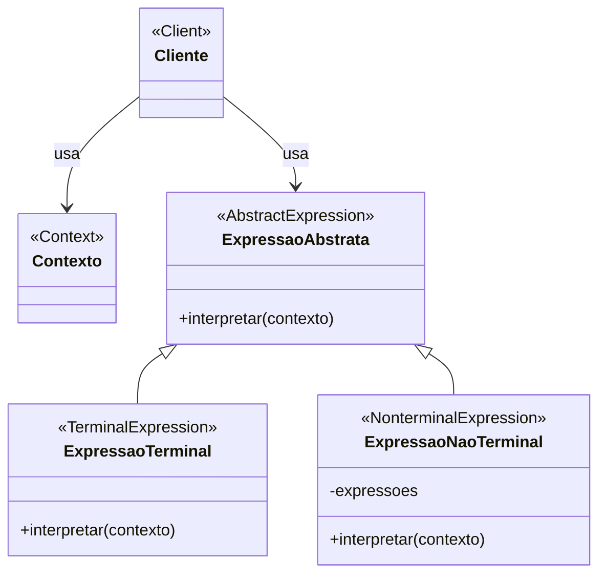

# Padrão de Projeto Interpretador (Interpreter)

## Intenção

O padrão Interpretador define uma representação gramatical para uma linguagem e fornece um interpretador para lidar com
essa gramática. É usado para interpretar sentenças em uma linguagem.

## Diagrama de Estrutura

## Participantes

- **ExpressaoAbstrata (AbstractExpression)**: Declara uma interface para executar uma operação
- **ExpressaoTerminal (TerminalExpression)**: Implementa a operação de interpretação para símbolos terminais na
  gramática
- **ExpressaoNaoTerminal (NonterminalExpression)**: Implementa a operação de interpretação para símbolos não-terminais
  na gramática
- **Contexto (Context)**: Contém informações globais para o interpretador
- **Cliente (Client)**: Constrói a árvore de sintaxe abstrata representando uma sentença na linguagem e invoca a
  operação de interpretação

## Como Funciona

1. O cliente constrói uma árvore de sintaxe abstrata (AST) representando uma sentença na linguagem
2. Cada nó na árvore é um objeto de expressão (terminal ou não-terminal)
3. O cliente invoca a operação de interpretação no nó raiz
4. Cada nó interpreta sua parte da sentença, possivelmente delegando para nós filhos
5. O resultado é a interpretação da sentença inteira

## Exemplo Prático: Interpretador de Linguagem de Consulta Simples

Imagine uma linguagem de consulta simples para pesquisar registros em um banco de dados, onde os usuários podem escrever
expressões como:
"nome = João E (idade > 30 OU departamento = 'Engenharia')"

### Estrutura para o Interpretador de Linguagem de Consulta

- **Expressao** (ExpressaoAbstrata): Interface com método interpretar
- **ExpressaoLiteral, ExpressaoVariavel** (ExpressoesTerminais): Expressões básicas como literais ou variáveis
- **ExpressaoE, ExpressaoOU, ExpressaoNAO** (ExpressoesNaoTerminais): Expressões compostas
- **Contexto**: Contém valores de variáveis e outros dados de interpretação
- **Analisador**: Converte a string de consulta em uma árvore de sintaxe abstrata de expressões

### Fluxo Conceitual

1. O usuário fornece uma string de consulta
2. O analisador converte a string em uma AST de objetos Expressao
3. A aplicação configura um Contexto com os valores do registro atual
4. A aplicação chama interpretar() na Expressao raiz com o Contexto
5. Cada Expressao avalia sua parte e retorna verdadeiro/falso
6. O registro é incluído nos resultados se a Expressao raiz retornar verdadeiro

### Cenário de Uso

- Usuário insere a consulta: "departamento = 'RH' E salario > 50000"
- O analisador constrói uma AST com uma ExpressaoE na raiz, contendo:
    - Uma ExpressaoIgual comparando "departamento" com "RH"
    - Uma ExpressaoMaiorQue comparando "salario" com 50000
- Para cada registro de funcionário:
    - O Contexto é preenchido com os dados desse registro
    - O método interpretar é chamado na expressão raiz
    - Se ambas as condições forem verdadeiras, o registro é incluído nos resultados

## Considerações de Implementação

1. **Complexidade da Gramática**:
    - Gramáticas simples funcionam melhor com este padrão
    - Para gramáticas complexas, considere usar geradores de analisadores ou ferramentas especializadas

2. **Construção da Árvore de Sintaxe Abstrata**:
    - Separe a análise (construção da AST) da interpretação
    - Considere usar o padrão Builder para construir a AST

3. **Representação da Expressão**:
    - Mantenha as expressões simples e focadas
    - Considere usar uma hierarquia de classes que espelhe a estrutura da gramática

4. **Gerenciamento de Contexto**:
    - Projete o Contexto para fornecer eficientemente as informações necessárias para as expressões
    - Considere a segurança de thread se múltiplos interpretadores rodarem concorrentemente

## Benefícios

- Facilita a implementação de uma linguagem simples ou DSL
- Regras gramaticais são representadas como classes, tornando-as fáceis de estender
- Adicionar novas expressões é simples sem alterar as existentes
- O padrão é adequado para interpretar expressões em gramáticas bem definidas

## Desvantagens

- Gramáticas complexas levam a hierarquias de classes grandes que são difíceis de manter
- Pode ser ineficiente para interpretar linguagens complexas
- Não é adequado para linguagens que mudam frequentemente
- A depuração pode ser difícil devido à natureza recursiva da interpretação

## Padrões Relacionados

- **Composite**: O padrão Interpreter usa uma estrutura composta para a árvore de sintaxe abstrata
- **Flyweight**: Símbolos terminais podem ser compartilhados usando o padrão Flyweight
- **Iterator**: Usado para percorrer a árvore de sintaxe abstrata
- **Visitor**: Pode ser usado para adicionar operações às classes de expressão sem alterá-las
