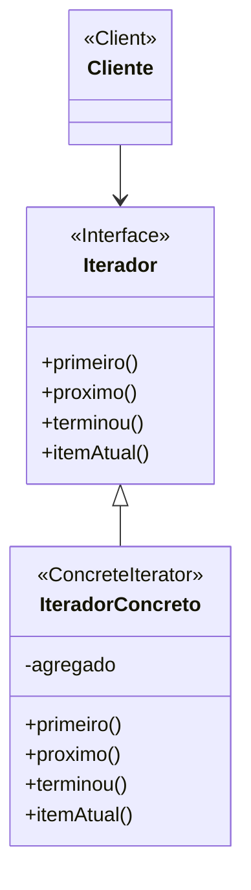

# Padrão de Projeto Iterador (Iterator)

## Intenção

O padrão Iterador fornece uma maneira de acessar sequencialmente os elementos de um objeto agregado sem expor sua
representação subjacente.

## Diagrama de Estrutura



## Participantes

- **Iterador (Iterator)**: Define uma interface para acessar e percorrer elementos
- **IteradorConcreto (ConcreteIterator)**: Implementa a interface Iterador e mantém o controle da posição atual na
  travessia
- **Agregado (Aggregate)**: Define uma interface para criar um objeto Iterador
- **AgregadoConcreto (ConcreteAggregate)**: Implementa a interface de criação do Iterador para retornar uma instância do
  IteradorConcreto apropriado

## Como Funciona

1. O Cliente solicita um iterador de um objeto agregado
2. O Agregado cria e retorna um IteradorConcreto específico para sua estrutura
3. O Cliente usa a interface do Iterador para percorrer os elementos sem conhecer a estrutura subjacente
4. O IteradorConcreto mantém o controle do elemento atual e sabe como navegar pelo agregado

## Exemplo Prático: Sistema de Navegação em Coleções

Imagine um sistema de catálogo de biblioteca que precisa exibir livros de diferentes tipos de coleções (arrays, listas,
árvores, etc.) de maneira consistente.

### Estrutura para o Sistema de Coleções

- **Iterador** (Iterator): Interface com métodos como temProximo(), proximo(), remover()
- **IteradorArray, IteradorLista, IteradorArvore** (IteradoresConcretos): Iteradores específicos para diferentes tipos
  de coleção
- **Colecao** (Agregado): Interface com um método criarIterador()
- **ColecaoArray, ColecaoLista, ColecaoArvore** (AgregadosConcretos): Diferentes implementações de coleção

### Fluxo Conceitual

1. O sistema de biblioteca precisa exibir livros de uma coleção específica
2. Ele solicita um iterador da coleção chamando criarIterador()
3. A coleção retorna o iterador apropriado para sua estrutura interna
4. O sistema usa o iterador para acessar cada livro um por um
5. O iterador lida com os detalhes de percorrer o tipo específico de coleção

### Cenário de Uso

- Um usuário deseja navegar por todos os livros em uma categoria ordenados por título
- O sistema recupera uma ColecaoArvore contendo os livros
- O sistema solicita um iterador da coleção:
  ```java
  Iterador iterador = colecaoArvore.criarIterador();
  ```
- O sistema usa o iterador para exibir cada livro:
  ```java
  while (iterador.temProximo()) {
      Livro livro = (Livro) iterador.proximo();
      exibirLivro(livro);
  }
  ```
- Mais tarde, ao navegar por novos lançamentos (armazenados em um array), o mesmo código funciona com um iterador
  diferente

## Considerações de Implementação

1. **Posicionamento do Iterador**:
    - Defina se um iterador começa antes do primeiro elemento ou nele
    - Decida como lidar com operações inválidas (por exemplo, chamar proximo() quando terminou() é verdadeiro)

2. **Implementação do Iterador**:
    - Iteradores Externos vs. Internos: Iteradores externos são controlados pelo cliente, enquanto iteradores internos
      são controlados pelo próprio iterador
    - Iteradores Robustos: Lidam com modificações concorrentes na coleção

3. **Controle de Iteração**:
    - Iteradores apenas para frente vs. Iteradores bidirecionais
    - Travessia simples vs. Travessia filtrada

4. **Múltiplas Travessias**:
    - Suporte para múltiplos iteradores simultâneos sobre o mesmo agregado
    - Considere como os iteradores são afetados por mudanças no agregado

## Benefícios

- Fornece uma interface uniforme para percorrer diferentes estruturas agregadas
- Suporta múltiplas travessias do mesmo agregado simultaneamente
- Simplifica a interface do agregado removendo métodos de travessia
- Encapsula o algoritmo de travessia
- Permite variação no algoritmo de travessia

## Desvantagens

- Introduz classes adicionais que podem aumentar a complexidade
- Pode ser menos eficiente que o acesso direto aos elementos em alguns casos
- Pode causar problemas com modificação concorrente se não for implementado adequadamente
- O estado do iterador pode ser uma preocupação em alguns ambientes de programação

## Padrões Relacionados

- **Composite**: Iteradores são frequentemente usados para percorrer estruturas Composite
- **Factory Method**: Agregados frequentemente usam Factory Method para criar seus iteradores
- **Memento**: Pode ser usado com Iterator para capturar o estado de uma iteração
- **Visitor**: Ambos os padrões podem ser usados para operar em elementos de uma estrutura de objetos
