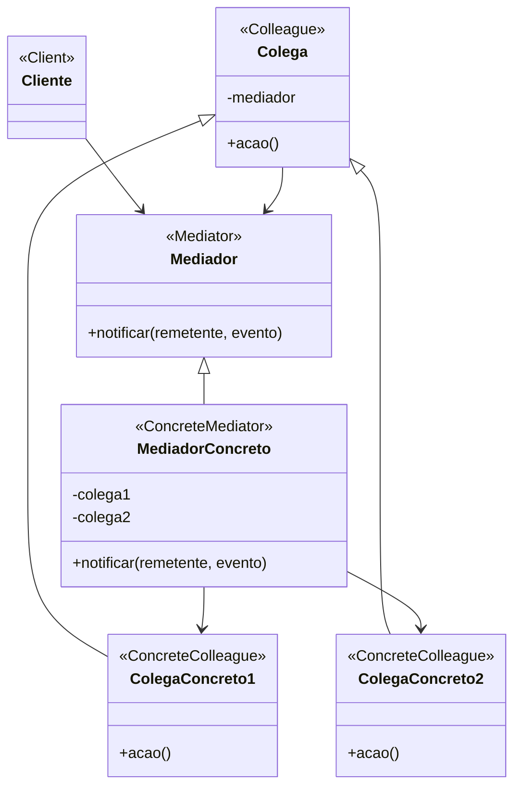

# Padrão de Projeto Mediador (Mediator)

## Intenção

O padrão Mediador define um objeto que encapsula como um conjunto de objetos interage. Ele promove o baixo acoplamento,
evitando que os objetos se refiram uns aos outros explicitamente, permitindo variar sua interação independentemente.

## Diagrama de Estrutura



## Participantes

- **Mediador (Mediator)**: Define uma interface para comunicação com objetos Colega
- **MediadorConcreto (ConcreteMediator)**: Implementa a interface Mediador e coordena a comunicação entre objetos Colega
- **Colega (Colleague)**: Define uma interface para objetos que se comunicam através de um mediador
- **ColegaConcreto (ConcreteColleague)**: Implementa a interface Colega e se comunica com outros Colegas através de seu
  mediador

## Como Funciona

1. Os Colegas se comunicam uns com os outros através do Mediador, em vez de diretamente
2. Quando um Colega deseja se comunicar com outro Colega, ele chama o método notificar do Mediador
3. O Mediador determina quais Colegas devem receber a mensagem e a encaminha adequadamente
4. Isso centraliza o controle e reduz as dependências entre Colegas individuais

## Exemplo Prático: Sistema de Controle de Tráfego Aéreo

Imagine um sistema de controle de tráfego aéreo onde múltiplas aeronaves precisam se comunicar e coordenar entre si para
evitar colisões e gerenciar sequências de pouso/decolagem.

### Estrutura para Controle de Tráfego Aéreo

- **MediadorControleTrafego** (Mediador): Interface definindo métodos para registrar aeronaves e lidar com comunicações
- **MediadorTorreControle** (MediadorConcreto): Implementa a coordenação de comunicação entre aeronaves
- **Aeronave** (Colega): Classe abstrata para diferentes tipos de aeronaves
- **Aviao, Helicoptero** (ColegasConcretos): Tipos específicos de aeronaves que se comunicam através do mediador

### Fluxo Conceitual

1. Aeronaves se registram na torre de controle (mediador) quando entram em seu espaço aéreo
2. Quando uma aeronave precisa mudar altitude, velocidade ou direção, ela notifica a torre de controle
3. A torre de controle determina se essa mudança afeta outras aeronaves nas proximidades
4. Se necessário, a torre emite instruções para outras aeronaves manterem separação segura
5. As aeronaves só precisam conhecer a torre, não umas às outras

### Cenário de Uso

- Um avião precisa pousar no aeroporto
- Ele envia uma solicitação de pouso para a torre de controle:
  ```java
  aviao.solicitarPouso();
  ```
- Internamente, isso chama:
  ```java
  mediador.notificar(this, "SOLICITAR_POUSO");
  ```
- A torre de controle avalia o tráfego atual e responde com instruções de pouso
- A torre também pode instruir outras aeronaves a mudarem altitude ou padrões de espera

## Considerações de Implementação

1. **Complexidade do Mediador**:
    - À medida que o sistema cresce, o mediador pode se tornar complexo e difícil de manter
    - Considere dividir mediadores grandes em menores, mais focados

2. **Protocolo de Comunicação**:
    - Defina um protocolo claro para como os colegas se comunicam com o mediador
    - Use objetos de evento, enums ou padrões de comando para comunicação estruturada

3. **Registro de Colegas**:
    - Decida como os colegas se registram no mediador (injeção de construtor, injeção de setter, etc.)
    - Considere se os colegas precisam cancelar o registro quando não estiverem mais ativos

4. **Integração com Padrão Observer**:
    - O padrão Mediador é frequentemente combinado com o padrão Observer
    - Colegas podem ser observadores do mediador para eventos específicos

## Benefícios

- Reduz o acoplamento entre componentes eliminando referências diretas entre eles
- Centraliza a lógica de interação em um só lugar, tornando-a mais fácil de entender e manter
- Simplifica protocolos de objetos substituindo interações muitos-para-muitos por um-para-muitos
- Facilita a reutilização de componentes individuais
- Permite alterar a interação entre objetos independentemente

## Desvantagens

- O mediador pode se tornar um monolito difícil de manter
- Centralizar o controle pode criar um único ponto de falha
- Pode introduzir gargalos de desempenho em sistemas de alto tráfego
- Pode levar ao anti-padrão "objeto deus" se não for cuidadosamente projetado

## Padrões Relacionados

- **Observer**: Mediador frequentemente usa o padrão Observer para notificação de colegas
- **Facade**: Mediador abstrai as interações entre subsistemas, enquanto Facade abstrai um subsistema em si
- **Command**: Commands podem ser usados para encapsular solicitações entre colegas e mediadores
- **Singleton**: Mediadores são frequentemente implementados como singletons
