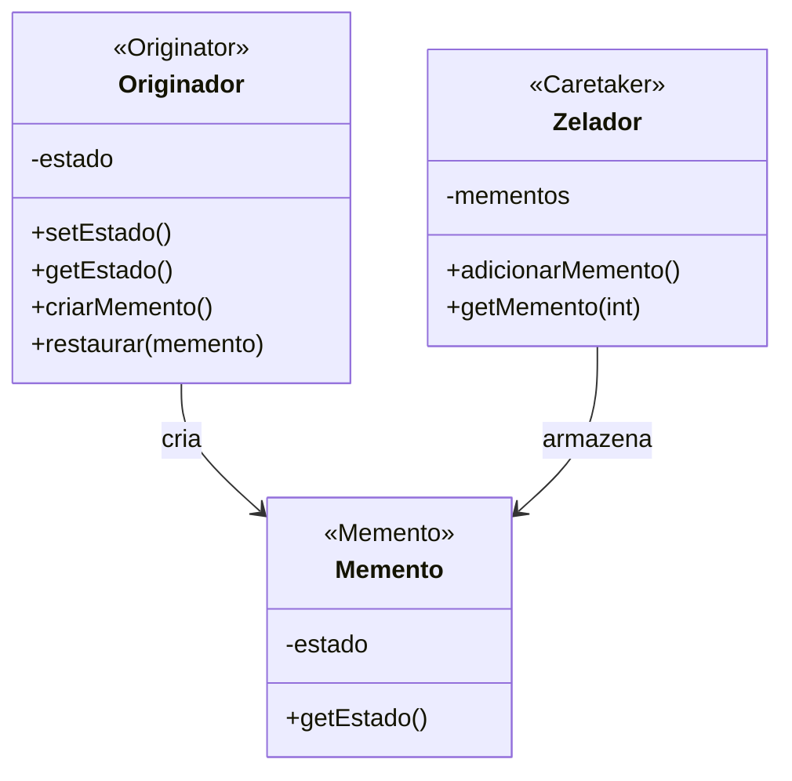

# Padrão de Projeto Memento

## Intenção

O padrão Memento captura e externaliza o estado interno de um objeto sem violar o encapsulamento, permitindo que o
objeto seja restaurado para esse estado posteriormente.

## Diagrama de Estrutura



## Participantes

- **Originador (Originator)**: Cria um memento contendo um instantâneo de seu estado interno atual e usa o memento para
  restaurar seu estado interno
- **Memento**: Armazena o estado interno do objeto Originador, protege contra acesso por objetos que não sejam o
  Originador
- **Zelador (Caretaker)**: Responsável pela guarda segura do memento, nunca opera ou examina o conteúdo de um memento

## Como Funciona

1. O Zelador solicita um memento do Originador quando precisa fazer um checkpoint do estado do Originador
2. O Originador cria um memento contendo um instantâneo de seu estado interno
3. O Zelador armazena o memento
4. Mais tarde, o Zelador devolve o memento ao Originador quando o Originador precisa restaurar um estado anterior
5. O Originador usa o memento para restaurar seu estado interno

## Exemplo Prático: Editor de Texto com Histórico de Versões

Imagine um aplicativo editor de texto que permite aos usuários desfazer alterações restaurando versões anteriores do
documento.

### Estrutura para o Editor de Texto

- **EditorTexto** (Originador): O editor que contém o conteúdo e a formatação do texto
- **EstadoEditor/Snapshot** (Memento): Captura o estado do editor em um momento específico
- **GerenciadorHistorico** (Zelador): Gerencia o histórico de estados do editor sem conhecer seu conteúdo

### Fluxo Conceitual

1. Conforme o usuário edita o documento, o aplicativo cria periodicamente instantâneos do estado do documento
2. Quando o usuário faz uma alteração significativa (ou aciona manualmente um salvamento), o EditorTexto cria um memento
3. O GerenciadorHistorico armazena esses mementos em ordem cronológica
4. Quando o usuário deseja desfazer alterações, o GerenciadorHistorico recupera um memento anterior
5. O EditorTexto usa esse memento para restaurar o conteúdo do documento para o estado anterior

### Cenário de Uso

- Um usuário edita um documento e o aplicativo captura automaticamente o estado:
  ```java
  Memento memento = editorTexto.criarMemento();
  gerenciadorHistorico.salvar(memento);
  ```
- Mais tarde, o usuário deseja desfazer as mudanças:
  ```java
  Memento estadoAnterior = gerenciadorHistorico.desfazer();
  editorTexto.restaurar(estadoAnterior);
  ```
- O editor reverte para o estado anterior sem revelar os detalhes internos do estado

## Considerações de Implementação

1. **Granularidade do Memento**:
    - Mementos podem armazenar o estado completo ou apenas as mudanças incrementais
    - Decidir a frequência da criação de mementos (a cada ação do usuário, a cada x segundos, etc.)

2. **Gerenciamento de Memória**:
    - Mementos podem consumir muita memória se armazenarem estados completos
    - Considere estratégias como armazenar apenas diferenças, compressão, ou limitar o número de mementos

3. **Privacidade do Estado**:
    - Em algumas linguagens, pode ser difícil proteger o acesso ao estado do memento
    - Use padrões de acesso aninhados, interfaces restritas ou amizade de classe quando disponível

4. **Versões e Metadados**:
    - Adicione timestamps, descrições ou outros metadados aos mementos
    - Isso permite navegação mais intuitiva em históricos de estados

## Benefícios

- Preserva o encapsulamento mantendo privadas as informações de estado do originador
- Simplifica o código do originador descarregando responsabilidades de armazenamento para o zelador
- Fornece um mecanismo limpo para captura e restauração de estado
- Permite reverter para estados anteriores (funcionalidade de desfazer)
- Mantém um histórico das mudanças de estado

## Desvantagens

- Pode consumir muita memória se os mementos armazenarem estados grandes ou numerosos
- Os zeladores precisam monitorar o originador para saber quando criar novos mementos
- Possíveis custos de desempenho na criação, armazenamento e restauração de estados
- Pode complicar o código se a lógica de criação/restauração for complexa

## Padrões Relacionados

- **Command**: Muitas vezes combinado com Memento para implementar operações desfazer/refazer
- **Iterator**: Pode ser usado para navegar pela história de mementos
- **Prototype**: Às vezes usado para implementar mementos leves via clonagem
- **Singleton**: Zeladores são frequentemente implementados como singletons
