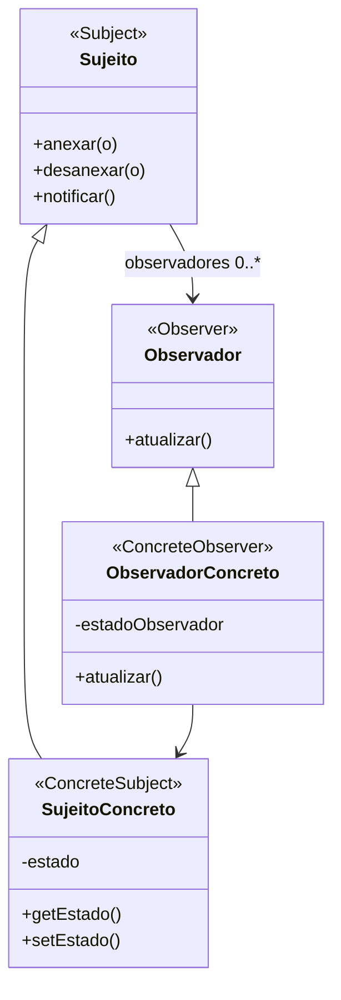

# Padrão de Projeto Observador (Observer)

## Intenção

O padrão Observador define uma dependência um-para-muitos entre objetos, de modo que quando um objeto muda de estado,
todos os seus dependentes são notificados e atualizados automaticamente.

## Diagrama de Estrutura



## Participantes

- **Sujeito (Subject)**: Conhece seus observadores e fornece uma interface para anexar e desanexar objetos Observador
- **SujeitoConcreto (ConcreteSubject)**: Armazena o estado de interesse para objetos ObservadorConcreto e envia
  notificações quando seu estado muda
- **Observador (Observer)**: Define uma interface de atualização para objetos que devem ser notificados sobre mudanças
- **ObservadorConcreto (ConcreteObserver)**: Mantém uma referência a um objeto SujeitoConcreto, implementa a interface
  de atualização do Observador e mantém seu estado consistente com o estado do sujeito

## Como Funciona

1. O Sujeito mantém uma lista de seus observadores e fornece métodos para adicionar ou remover observadores
2. Quando o estado de um sujeito muda, ele notifica todos os observadores anexados chamando seu método de atualização
3. Cada observador pode consultar o sujeito para obter o estado alterado e reagir de acordo
4. Isso cria um acoplamento fraco entre o sujeito e os observadores

## Exemplo Prático: Serviço de Assinatura de Notícias

Imagine um serviço de notícias onde os usuários podem assinar diferentes categorias de notícias e receber notificações
quando novos artigos são publicados.

### Estrutura para o Sistema de Assinatura de Notícias

- **PublicadorDeNotícias** (Sujeito): Gerencia assinantes e os notifica sobre novos artigos
- **AssinanteDeNotícias** (Observador): Interface para todos os assinantes que desejam receber atualizações de notícias
- **CategoriaDeNotícias** (SujeitoConcreto): Representa categorias específicas de notícias (Esportes, Política,
  Tecnologia)
- **Usuario, AplicativoMobile, ServiçoEmail** (ObservadorConcreto): Diferentes tipos de assinantes que recebem e
  processam atualizações

### Fluxo Conceitual

1. Usuários se registram (anexam) para receber atualizações de categorias específicas de notícias
2. Quando uma nova notícia é publicada em uma categoria, a CategoriaDeNotícias atualiza seu estado
3. A CategoriaDeNotícias chama notificar() para informar todos os assinantes sobre a nova notícia
4. Cada assinante recebe a notificação através de seu método atualizar() e pode recuperar os detalhes da notícia
5. Diferentes tipos de assinantes podem processar as notificações de maneiras diferentes (exibir na interface, enviar
   email, etc.)

### Cenário de Uso

- Um usuário se inscreve para receber notícias de tecnologia:
  ```java
  categoriaTecnologia.anexar(usuario);
  ```
- Um novo artigo sobre IA é publicado na categoria tecnologia:
  ```java
  categoriaTecnologia.setEstado(novoArtigoIA);
  categoriaTecnologia.notificar();
  ```
- Internamente, isso chama o método atualizar() para cada observador:
  ```java
  // Dentro do método notificar():
  for (Observador obs : observadores) {
      obs.atualizar();
  }
  ```
- Cada assinante recebe a notificação e recupera o artigo mais recente

## Considerações de Implementação

1. **Notificação por Push vs. Pull**:
    - Notificação Push: O sujeito envia informações detalhadas para os observadores
    - Notificação Pull: Os observadores solicitam informações do sujeito após serem notificados
    - Escolha baseada no equilíbrio entre eficiência de comunicação e acoplamento

2. **Gerenciamento de Observadores**:
    - Implementação eficiente para adicionar/remover observadores (listas, conjuntos, etc.)
    - Considere a ordem de notificação (se relevante para sua aplicação)
    - Trate observadores inativos ou que foram removidos incorretamente

3. **Consistência de Estado**:
    - Decida quando notificar observadores (após cada mudança ou em lotes)
    - Garanta que o estado do sujeito seja consistente antes de notificar
    - Evite ciclos de notificação quando observadores também são sujeitos

4. **Observadores Específicos vs. Gerais**:
    - Defina se observadores receberão todas as notificações ou apenas tipos específicos
    - Implemente filtros ou canais de eventos para notificações específicas

## Benefícios

- Permite acoplamento fraco entre objetos que interagem
- Suporta comunicação de broadcast
- Facilita a adição de novos observadores sem modificar o sujeito
- Os observadores podem ser adicionados e removidos dinamicamente
- Segue o princípio de design aberto/fechado

## Desvantagens

- Pode levar a notificações em cascata ou inesperadas
- Os observadores são notificados em ordem indeterminada
- Possível vazamento de memória se observadores não forem desanexados corretamente
- Pode ser difícil rastrear mudanças em sistemas complexos
- Possíveis problemas de desempenho com muitos observadores

## Padrões Relacionados

- **Mediator**: O padrão Observer distribui comunicação definindo um objeto one-to-many, enquanto o Mediator encapsula
  comunicação many-to-many
- **Singleton**: Sujeitos são frequentemente implementados como singletons
- **Command**: Commands podem ser usados para transformar solicitações em objetos para armazenamento e enfileiramento de
  notificações
- **Memento**: Pode ser usado com Observer para manter o estado quando observadores precisam restaurar estados
  anteriores
