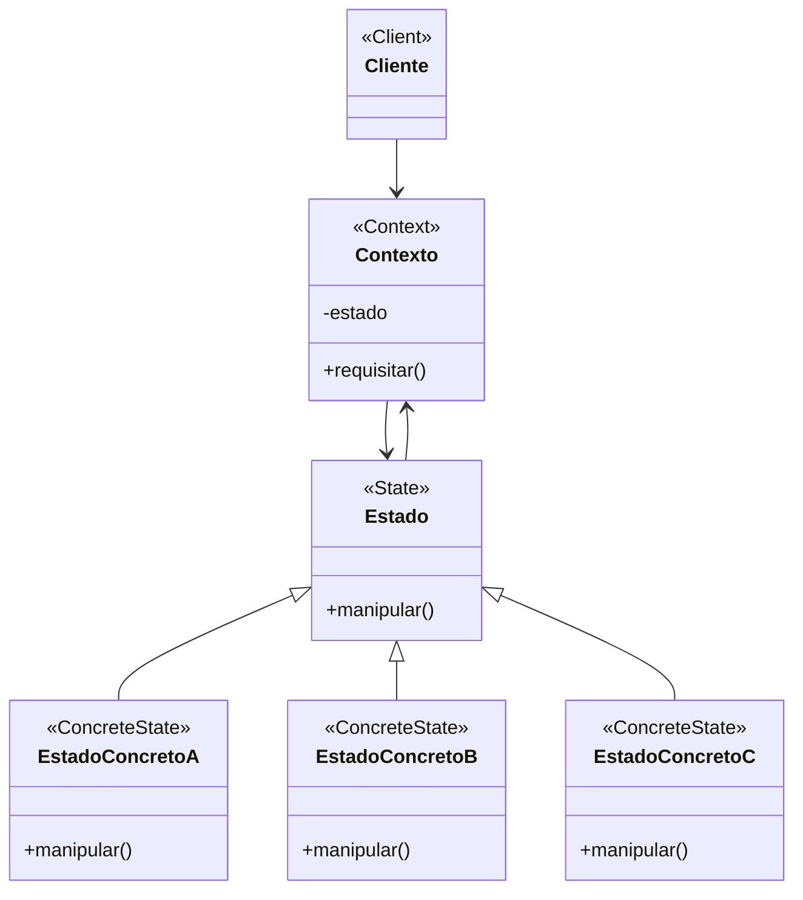

# Padrão de Projeto Estado (State)

## Intenção

O padrão Estado permite que um objeto altere seu comportamento quando seu estado interno muda. O objeto parecerá mudar
sua classe.

## Diagrama de Estrutura



## Participantes

- **Contexto (Context)**: Define a interface de interesse para os clientes e mantém uma instância de um EstadoConcreto
  que define o estado atual
- **Estado (State)**: Define uma interface para encapsular o comportamento associado a um estado particular do Contexto
- **EstadoConcreto (ConcreteState)**: Cada subclasse implementa o comportamento associado a um estado do Contexto

## Como Funciona

1. O Contexto delega requisições específicas de estado para o objeto EstadoConcreto atual
2. O Contexto pode passar a si mesmo como argumento para o objeto Estado que manipula a requisição
3. Os clientes configuram um contexto com objetos EstadoConcreto
4. As transições de estado podem ser controladas pelo Contexto, pelos objetos EstadoConcreto, ou ambos

## Exemplo Prático: Máquina de Vendas

Imagine uma máquina de vendas que altera seu comportamento dependendo do seu estado interno (sem moedas, com moedas,
produto selecionado, produto entregue).

### Estrutura para a Máquina de Vendas

- **MaquinaVendas** (Contexto): A máquina de vendas que mantém referência ao estado atual
- **EstadoMaquina** (Estado): Interface para todos os estados possíveis da máquina
- **SemMoeda, ComMoeda, ProdutoSelecionado, EntregandoProduto** (EstadosConcretos): Estados específicos da máquina

### Fluxo Conceitual

1. A máquina começa no estado SemMoeda
2. Quando um usuário insere moedas, a máquina muda para o estado ComMoeda
3. Após o usuário selecionar um produto, a máquina muda para o estado ProdutoSelecionado
4. Finalmente, a máquina muda para o estado EntregandoProduto e depois volta para SemMoeda
5. Cada estado implementa comportamentos específicos para eventos como inserirMoeda(), selecionarProduto(),
   entregarProduto()

### Cenário de Uso

- A máquina começa no estado SemMoeda:
  ```java
  MaquinaVendas maquina = new MaquinaVendas();
  maquina.setEstado(new SemMoeda(maquina));
  ```
- Um usuário insere moedas, a máquina delega ao estado atual:
  ```java
  maquina.inserirMoeda();  // Delega para estado.inserirMoeda()
  ```
- O estado SemMoeda manipula o evento e muda o estado da máquina:
  ```java
  // Dentro do método inserirMoeda() de SemMoeda:
  System.out.println("Moeda aceita");
  contexto.setEstado(new ComMoeda(contexto));
  ```
- Agora a máquina está no estado ComMoeda e responderá de forma diferente aos mesmos eventos

## Considerações de Implementação

1. **Quem Define as Transições de Estado**:
    - Estados controlam transições: Cada estado determina qual será o próximo estado
    - Contexto controla transições: O contexto decide qual estado será o próximo com base em sua lógica interna
    - Abordagem híbrida: Compartilhamento de responsabilidade entre contexto e estados

2. **Compartilhamento vs. Instâncias de Estado**:
    - Estados sem atributos: Podem ser compartilhados entre múltiplos contextos (Flyweight)
    - Estados com atributos: Geralmente requerem instâncias separadas para cada contexto

3. **Criação e Destruição de Estados**:
    - Criação sob demanda: Estados são criados quando necessários
    - Pré-criação: Todos os estados possíveis são criados antecipadamente e reutilizados
    - Contexto frequentemente mantém referências a todos os estados possíveis

4. **Implementação de Transições**:
    - Tabelas de transição: Mapear eventos e estados atuais para novos estados
    - Padrão de código: Lógica condicional implementada nos métodos manipuladores

## Benefícios

- Localiza comportamentos específicos de estado em classes separadas
- Torna transições de estado explícitas
- Objetos Estado podem ser compartilhados
- Elimina condicionais volumosos
- Facilita a adição de novos estados sem alterar o contexto
- Segue o princípio de responsabilidade única

## Desvantagens

- Pode introduzir muitas classes se houver muitos estados
- Pode resultar em transições de estado difíceis de rastrear se estiverem espalhadas por várias classes
- Pode ser excessivo para máquinas de estado simples
- Complexidade de implementação aumenta quando estados precisam armazenar histórico

## Padrões Relacionados

- **Flyweight**: Estados sem atributos podem ser compartilhados usando o padrão Flyweight
- **Singleton**: Estados são frequentemente implementados como singletons se não armazenam dados específicos do contexto
- **Strategy**: State é como Strategy, mas com estado envolvido e transições entre comportamentos
- **Command**: Commands podem encapsular estados em um comando para serem armazenados para uso posterior
