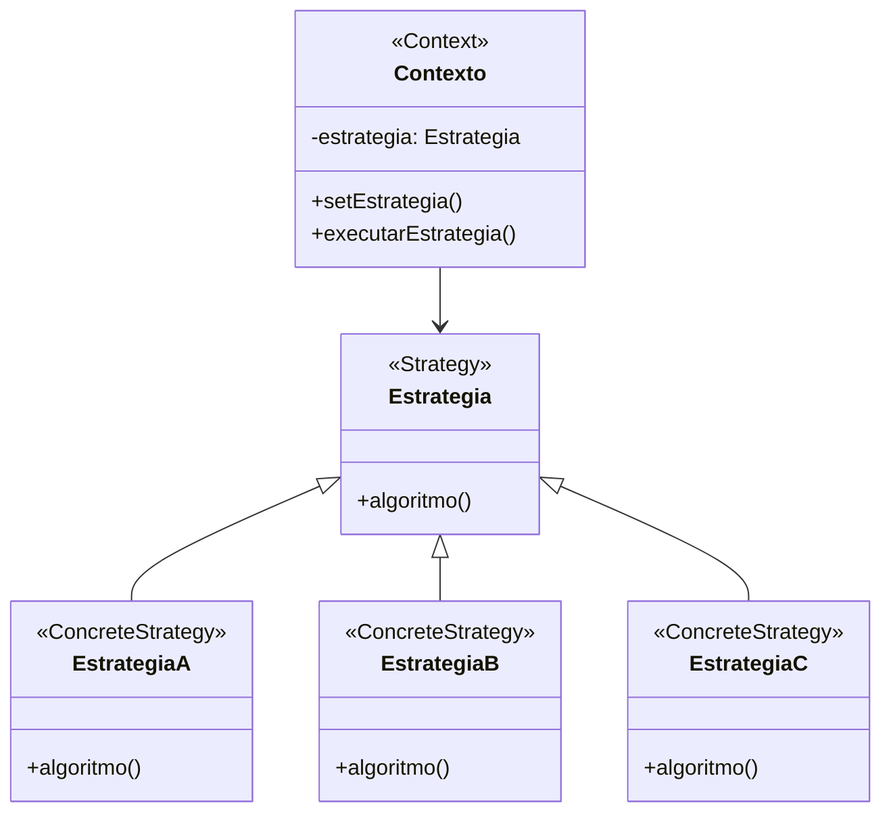

# Padrão de Projeto Estratégia (Strategy)

## Intenção

O padrão Estratégia define uma família de algoritmos, encapsula cada um deles e os torna intercambiáveis. Estratégia
permite que o algoritmo varie independentemente dos clientes que o utilizam.

## Diagrama de Estrutura



## Participantes

- **Estratégia (Strategy)**: Declara uma interface comum a todos os algoritmos suportados
- **EstrategiaConcreta (ConcreteStrategy)**: Implementa o algoritmo usando a interface Estratégia
- **Contexto (Context)**: É configurado com um objeto EstrategiaConcreta, mantém uma referência a um objeto Estratégia e
  pode definir uma interface que permite à Estratégia acessar seus dados

## Como Funciona

1. O Contexto delega um comportamento específico a um objeto Estratégia
2. O Contexto é configurado com um objeto EstrategiaConcreta
3. O Contexto encaminha solicitações de seus clientes para sua Estratégia
4. Os clientes geralmente criam e passam uma EstrategiaConcreta para o Contexto
5. A Estratégia executa seu algoritmo usando dados fornecidos pelo Contexto

## Exemplo Prático: Sistema de Processamento de Pagamento

Imagine uma aplicação de e-commerce que precisa suportar múltiplos métodos de pagamento (cartão de crédito, PayPal,
transferência bancária, etc.).

### Estrutura para o Sistema de Pagamento

- **EstrategiaPagamento** (Estratégia): Interface que define o algoritmo do método de pagamento
- **PagamentoCartaoCredito, PagamentoPayPal, PagamentoTransferenciaBancaria** (EstrategiasConcretras): Classes
  implementando lógicas específicas de processamento de pagamento
- **CarrinhoCompras** (Contexto): Usa uma estratégia de pagamento para processar o pagamento dos itens no carrinho

### Fluxo Conceitual

1. Um cliente adiciona itens ao seu carrinho de compras
2. Na finalização, o cliente escolhe um método de pagamento
3. O sistema cria a estratégia apropriada baseada na escolha do cliente
4. O carrinho de compras (contexto) é configurado com essa estratégia
5. Quando o cliente confirma, o carrinho chama o método de processamento da estratégia
6. A estratégia escolhida executa sua lógica específica de processamento de pagamento

### Cenário de Uso

- Um cliente escolhe pagar com PayPal:
  ```java
  CarrinhoCompras carrinho = new CarrinhoCompras();
  // Adicionar itens ao carrinho
  carrinho.setEstrategiaPagamento(new PagamentoPayPal(email, senha));
  carrinho.finalizarCompra();
  ```
- Internamente, o método finalizarCompra() chama:
  ```java
  // Dentro do método finalizarCompra() do CarrinhoCompras:
  float total = calcularTotal();
  boolean sucesso = estrategiaPagamento.processarPagamento(total);
  ```
- A estratégia PagamentoPayPal executa sua lógica específica para processar o pagamento via PayPal

## Considerações de Implementação

1. **Configuração de Estratégias**:
    - No construtor: Estratégia definida quando o Contexto é criado
    - Por método setter: Estratégia pode ser alterada durante o tempo de vida do Contexto
    - No método de execução: Estratégia passada como parâmetro quando necessária

2. **Compartilhamento de Dados**:
    - Contexto passa dados para a Estratégia: Mais encapsulado, mas pode exigir muitos parâmetros
    - Contexto passa a si mesmo: Estratégia pode acessar qualquer dado do Contexto, mas aumenta acoplamento
    - Dados armazenados na Estratégia: Útil quando a Estratégia mantém estado entre chamadas

3. **Estratégias Parametrizadas**:
    - Estratégias podem ter parâmetros de configuração
    - Podem implementar fábricas para criar variantes de estratégias

4. **Estratégias Opcionais**:
    - Contexto pode verificar se a estratégia é nula e fornecer comportamento padrão
    - Padrão Null Object pode ser usado para fornecer implementação de "não fazer nada"

## Benefícios

- Famílias de algoritmos relacionados
- Uma alternativa à subclassificação
- Elimina instruções condicionais
- Permite a escolha de implementações
- Os clientes ficam desacoplados de implementações específicas
- As estratégias podem ser trocadas em tempo de execução

## Desvantagens

- Clientes devem conhecer as diferentes estratégias
- Aumento no número de objetos
- Sobrecarga de comunicação entre estratégia e contexto
- Pode introduzir complexidade desnecessária para algoritmos simples

## Padrões Relacionados

- **Factory Method**: Muitas vezes usado para criar estratégias
- **Flyweight**: Estratégias sem estado podem ser compartilhadas
- **Template Method**: Alternativa ao Strategy, define o esqueleto de um algoritmo com etapas substituíveis
- **Command**: Semelhante a Strategy, mas focado em empacotamento de ações em vez de algoritmos
- **State**: Como Strategy, mas com foco em alteração de comportamento baseada no estado interno
