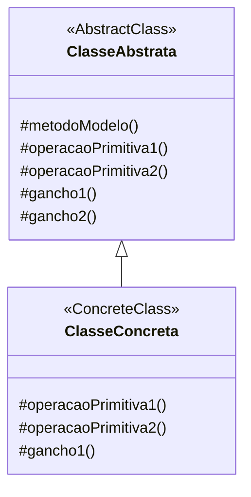

# Padrão de Projeto Método Modelo (Template Method)

## Intenção

O padrão Método Modelo define o esqueleto de um algoritmo em um método, adiando alguns passos para subclasses. Ele
permite que as subclasses redefinam certos passos de um algoritmo sem alterar a estrutura do algoritmo.

## Diagrama de Estrutura



## Participantes

- **ClasseAbstrata (AbstractClass)**: Define operações primitivas abstratas que subclasses concretas devem implementar,
  implementa um método modelo que define o esqueleto de um algoritmo, e pode definir métodos gancho com implementações
  padrão
- **ClasseConcreta (ConcreteClass)**: Implementa as operações primitivas para executar passos específicos da subclasse
  no algoritmo

## Como Funciona

1. A ClasseAbstrata define um metodoModelo() que contém o esqueleto de um algoritmo
2. O metodoModelo() chama operações primitivas e ganchos em uma sequência específica
3. A ClasseConcreta implementa as operações primitivas para executar passos específicos
4. O cliente chama o metodoModelo() em uma instância da ClasseConcreta
5. A estrutura do algoritmo permanece inalterada, mas passos específicos podem ser redefinidos pelas subclasses

## Exemplo Prático: Sistema de Processamento de Documentos

Imagine um sistema de processamento de documentos que precisa lidar com diferentes tipos de documentos (relatórios,
faturas, cartas) com um fluxo de processamento padrão, mas detalhes de implementação diferentes.

### Estrutura para Processamento de Documentos

- **ProcessadorDocumento** (ClasseAbstrata): Classe abstrata com um método modelo processarDocumento() que define o
  fluxo padrão de processamento de documentos
- **ProcessadorRelatorio, ProcessadorFatura, ProcessadorCarta** (ClassesConcretas): Implementações específicas para
  diferentes tipos de documentos

### Fluxo Conceitual

1. O método modelo processarDocumento() define os passos padrão:
    - Abrir documento
    - Extrair dados
    - Formatar conteúdo
    - Validar documento
    - Salvar documento
    - Notificar conclusão

2. Algumas dessas etapas são implementadas no método modelo, outras são operações primitivas que as subclasses devem
   implementar:
    - extrairDados() - Abstrato, implementado por subclasses
    - formatarConteudo() - Abstrato, implementado por subclasses
    - validar() - Abstrato, implementado por subclasses

3. Alguns passos podem ser ganchos opcionais que as subclasses podem personalizar:
    - preProcessamento() - Gancho com implementação padrão
    - posProcessamento() - Gancho com implementação padrão

### Cenário de Uso

- O sistema recebe um documento para processar:
  ```java
  ProcessadorDocumento processador;
  if (documento.getTipo().equals("RELATORIO")) {
      processador = new ProcessadorRelatorio();
  } else if (documento.getTipo().equals("FATURA")) {
      processador = new ProcessadorFatura();
  } else {
      processador = new ProcessadorCarta();
  }
  processador.processarDocumento(documento);
  ```

- O método processarDocumento() executa o algoritmo completo:
  ```java

// Na classe ProcessadorDocumento:
public void processarDocumento(Documento doc) {
preProcessamento(doc); // Gancho
abrir(doc); // Implementação comum
extrairDados(doc); // Abstrato
formatarConteudo(doc); // Abstrato
validar(doc); // Abstrato
salvar(doc); // Implementação comum
posProcessamento(doc); // Gancho
notificar(doc); // Implementação comum
}

```

- Cada tipo de processador implementa os métodos abstratos de acordo com as necessidades específicas do tipo de
  documento

## Considerações de Implementação

1. **Operações Primitivas vs. Ganchos**:
    - Operações primitivas: Abstratas, devem ser implementadas por subclasses
    - Ganchos: Têm implementação padrão, subclasses podem sobrescrever se necessário

2. **Controle de Inversão**:
    - O "princípio de Hollywood": "Não nos chame, nós chamaremos você"
    - A classe base controla o fluxo e chama as operações das subclasses quando necessário

3. **Métodos Modelo Finais**:
    - Geralmente o método modelo é declarado como final para evitar que subclasses alterem o algoritmo base

4. **Implementações Padrão**:
    - Forneça implementações padrão sensatas para ganchos sempre que possível
    - Considere tornar os ganchos protegidos para evitar chamadas públicas

## Benefícios

- Reutilização de código: O código comum fica na superclasse
- Controle sobre pontos de extensão: Apenas certos passos podem ser sobrescritos
- Garante estrutura: O algoritmo geral permanece consistente
- Facilita a manutenção: Alterações no algoritmo são centralizadas
- Promove o princípio de substituição de Liskov

## Desvantagens

- Pode levar a uma hierarquia de classes complexa
- Limitações na extensibilidade: A sequência de passos é fixa
- Dificuldade com multithreading: Cuidado necessário ao lidar com estado compartilhado
- Possível violação do princípio de responsabilidade única se o algoritmo for muito complexo

## Padrões Relacionados

- **Strategy**: Diferente do Template Method que usa herança, o Strategy usa composição para alterar partes do algoritmo
- **Factory Method**: Frequentemente usado dentro de Template Methods para criar objetos apropriados
- **Builder**: Pode ser usado com Template Method quando a construção requer diferentes passos para diferentes
  representações
- **Hook Method**: Parte do padrão Template Method, permite extensão opcional em pontos específicos
