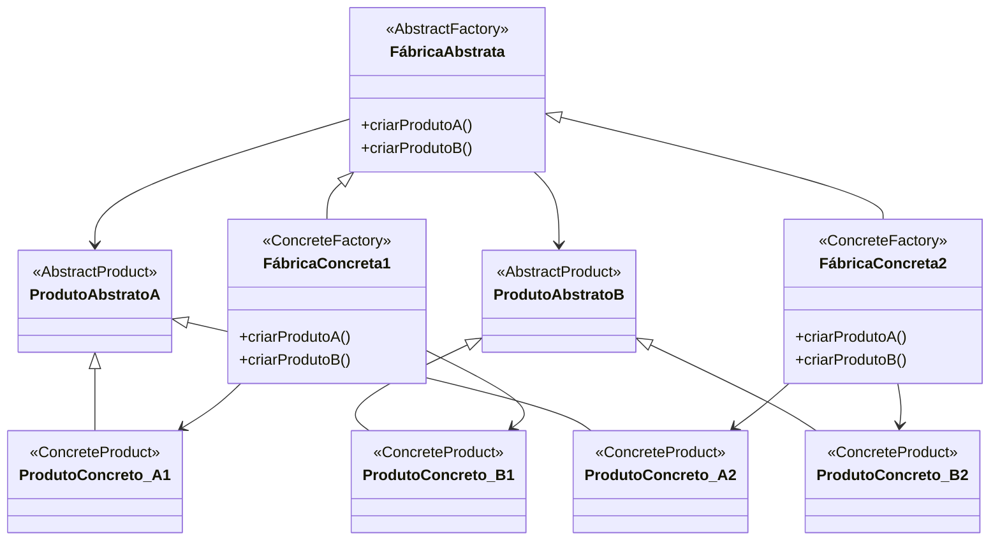

# Padrão de Projeto Fábrica Abstrata (Abstract Factory)

## Intenção

O padrão Fábrica Abstrata fornece uma interface para criar famílias de objetos relacionados ou dependentes sem
especificar suas classes concretas.

## Diagrama de Estrutura



## Participantes

- **FábricaAbstrata (AbstractFactory)**: Declara uma interface para operações que criam objetos de produtos abstratos
- **FábricaConcreta (ConcreteFactory)**: Implementa as operações para criar objetos de produtos concretos
- **ProdutoAbstrato (AbstractProduct)**: Declara uma interface para um tipo de objeto produto
- **ProdutoConcreta (ConcreteProduct)**: Define um objeto produto a ser criado pela fábrica concreta correspondente
- **Cliente (Client)**: Usa apenas interfaces declaradas pelas classes FábricaAbstrata e ProdutoAbstrato

## Como Funciona

1. O cliente interage com a FábricaAbstrata e os objetos ProdutoAbstrato
2. O cliente é configurado com uma FábricaConcreta específica
3. A FábricaConcreta cria instâncias de ProdutoConcreto
4. O cliente não precisa saber quais classes concretas estão sendo usadas

## Exemplo Prático: Sistema de Interface Gráfica Multiplataforma

Imagine um framework de GUI que precisa funcionar em diferentes plataformas (Windows, macOS, Linux) mantendo uma
aparência consistente com cada sistema operacional.

### Estrutura para o Sistema de GUI

- **FábricaGUI** (FábricaAbstrata): Interface para criar componentes de GUI
- **FábricaGUIWindows, FábricaGUIMacOS, FábricaGUILinux** (FábricasConcretas): Criam componentes específicos para cada
  plataforma
- **Botão, CaixaTexto, Menu** (ProdutosAbstratos): Interfaces para diferentes tipos de componentes
- **BotãoWindows, CaixaTextoWindows, BotãoMacOS, etc.** (ProdutosConcretos): Implementações específicas de plataforma

### Fluxo Conceitual

1. A aplicação detecta o sistema operacional em uso
2. Com base nessa detecção, a aplicação instancia a fábrica concreta apropriada
3. A aplicação usa a fábrica para criar todos os componentes de interface necessários
4. Todos os componentes são consistentes com a plataforma atual

### Cenário de Uso

- A aplicação identifica que está rodando no macOS:
  ```java
  FábricaGUI fábrica = new FábricaGUIMacOS();
  ```
- A aplicação cria componentes usando a fábrica:
  ```java
  Botão botãoOK = fábrica.criarBotão();
  CaixaTexto campoNome = fábrica.criarCaixaTexto();
  Menu menuArquivo = fábrica.criarMenu();
  ```
- Cada componente terá aparência e comportamento nativos do macOS
- A mesma aplicação rodando no Windows usaria a FábricaGUIWindows e teria aparência de Windows

## Considerações de Implementação

1. **Extensibilidade**:
    - Para adicionar novos tipos de produtos, é necessário modificar a interface da fábrica abstrata e todas as suas
      implementações
    - Para adicionar novas famílias de produtos (por exemplo, uma nova plataforma), basta criar novas fábricas concretas

2. **Consistência entre Produtos**:
    - O padrão garante que os produtos sejam compatíveis entre si
    - Objetos de diferentes famílias não devem ser misturados

3. **Configuração do Sistema**:
    - Geralmente há apenas uma instância de fábrica concreta por aplicação
    - A fábrica pode ser selecionada em tempo de execução ou de compilação

4. **Produtos Opcionais**:
    - Considere como lidar com produtos que não são suportados por todas as plataformas
    - Opções incluem interfaces de produtos nulas ou exceções bem documentadas

## Benefícios

- Isola classes concretas do cliente
- Facilita a troca de famílias de produtos
- Promove consistência entre produtos
- Suporta o princípio de design "Programar para interfaces, não implementações"
- Facilita a adição de novos tipos de produtos para famílias existentes

## Desvantagens

- Dificulta a adição de novos tipos de produtos que não foram previstos na interface da fábrica
- Pode introduzir muitas interfaces e classes para implementar o padrão
- Pode ser complexo para casos de uso simples
- Todas as fábricas concretas devem implementar todos os produtos, mesmo que não façam sentido para aquela família

## Padrões Relacionados

- **Factory Method**: Frequentemente usado dentro de implementações de Abstract Factory
- **Singleton**: Fábricas concretas são frequentemente implementadas como singletons
- **Prototype**: Pode ser usado com Abstract Factory para evitar criar múltiplas fábricas concretas
- **Flyweight**: Produtos criados pela fábrica podem usar o padrão Flyweight para compartilhar partes comuns
