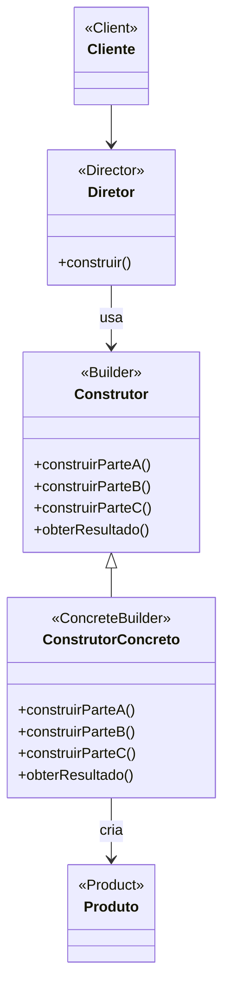

# Padrão de Projeto Construtor (Builder)

## Intenção

O padrão Construtor separa a construção de um objeto complexo de sua representação, permitindo que o mesmo processo de
construção crie diferentes representações.

## Diagrama de Estrutura



## Participantes

- **Construtor (Builder)**: Especifica uma interface abstrata para criar partes de um objeto Produto
- **ConstrutorConcreto (ConcreteBuilder)**: Constrói e monta partes do produto implementando a interface Construtor
- **Diretor (Director)**: Constrói um objeto usando a interface Construtor
- **Produto (Product)**: Representa o objeto complexo em construção
- **Cliente (Client)**: Cria o objeto Diretor e o configura com o objeto Construtor desejado

## Como Funciona

1. O Cliente cria o objeto Diretor e o configura com o objeto Construtor desejado
2. O Diretor notifica o Construtor sempre que uma parte deve ser construída
3. O Construtor lida com os pedidos e adiciona partes ao produto
4. O Cliente recupera o produto do Construtor

## Exemplo Prático: Sistema de Construção de Documentos

Imagine um sistema que cria diferentes tipos de documentos (PDF, HTML, texto simples) com estrutura semelhante mas
formatos diferentes.

### Estrutura para o Sistema de Documentos

- **ConstrutorDocumento** (Construtor): Interface para criar diferentes partes de um documento
- **ConstrutorPDF, ConstrutorHTML, ConstrutorTexto** (ConstrutoresConcretros): Implementações para diferentes formatos
- **DiretorDocumento** (Diretor): Coordena a construção de documentos com estrutura específica
- **Documento** (Produto): O documento final que foi construído

### Fluxo Conceitual

1. O aplicativo decide qual formato de documento criar e instancia o construtor apropriado
2. O diretor é configurado com esse construtor
3. O diretor chama métodos de construção específicos em uma ordem particular
4. O construtor cria internamente o documento e formata partes de acordo com o formato específico
5. O aplicativo obtém o documento finalizado do construtor

### Cenário de Uso

- O aplicativo precisa gerar um relatório em HTML:
  ```java
  ConstrutorDocumento construtor = new ConstrutorHTML();
  DiretorDocumento diretor = new DiretorDocumento(construtor);
  diretor.construirRelatorioSimples("Título do Relatório", "Conteúdo...", "Autor");
  Documento relatorioHTML = construtor.obterDocumento();
  ```
- Para gerar o mesmo relatório em PDF, apenas muda o construtor:
  ```java
  ConstrutorDocumento construtor = new ConstrutorPDF();
  DiretorDocumento diretor = new DiretorDocumento(construtor);
  diretor.construirRelatorioSimples("Título do Relatório", "Conteúdo...", "Autor");
  Documento relatorioPDF = construtor.obterDocumento();
  ```
- O DiretorDocumento pode oferecer diferentes métodos para diferentes estruturas de documentos:
  ```java
  diretor.construirRelatorioCompleto();
  diretor.construirManual();
  diretor.construirFAQ();
  ```

## Considerações de Implementação

1. **Interface do Construtor**:
    - Defina métodos para cada componente do produto
    - Decida se o obterResultado() retorna um tipo genérico ou específico

2. **Diretor Opcional**:
    - Em algumas implementações, o papel do Diretor pode ser assumido pelo Cliente
    - Considere fornecer um Diretor quando sequências de construção são reutilizáveis

3. **Construtores em Fluent Interface**:
    - Uma variação comum é o "Builder Fluente" onde métodos retornam o próprio construtor
    - Permite encadeamento de chamadas: construtor.parteA().parteB().parteC()

4. **Produtos Imutáveis**:
    - Builder é especialmente útil para criar objetos imutáveis com muitos parâmetros
    - Evita construtores com muitos parâmetros e objetos em estado parcialmente inicializado

## Benefícios

- Permite variar a representação interna de um produto
- Isola o código de construção da representação
- Oferece controle mais fino sobre o processo de construção
- Permite construção passo a passo, adiando etapas ou executando-as recursivamente
- Esconde detalhes de como o produto é montado

## Desvantagens

- Requer criar uma classe Construtor separada para cada tipo diferente de Produto
- Exige que o construtor seja mutável, enquanto o produto pode ser imutável
- Pode introduzir duplicação de código se produtos não compartilharem uma interface comum
- Adiciona complexidade à base de código

## Padrões Relacionados

- **Abstract Factory**: Builder foca no passo a passo para construir objetos complexos, enquanto Abstract Factory
  enfatiza famílias de objetos
- **Composite**: Builders frequentemente constroem produtos Composite
- **Factory Method**: Builder é para criação passo a passo de um objeto complexo, Factory Method para criar um objeto em
  uma única etapa
- **Singleton**: O Builder pode ser implementado como um Singleton se o mesmo Builder for reutilizado
