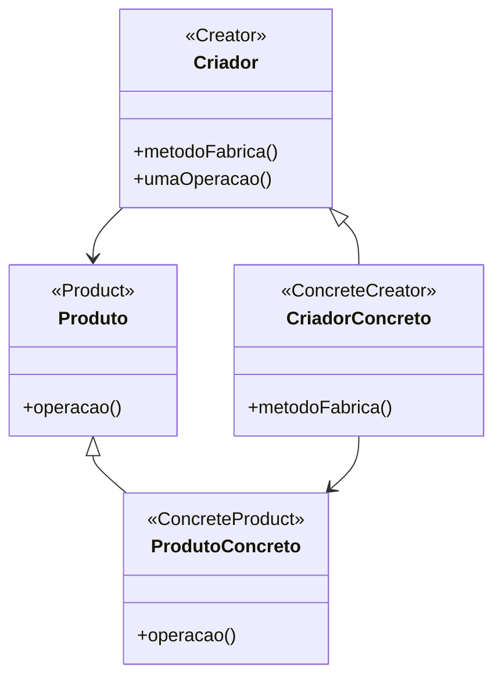

# Padrão de Projeto Método Fábrica (Factory Method)

## Intenção

O padrão Método Fábrica define uma interface para criar um objeto, mas deixa as subclasses decidirem qual classe
instanciar. O Método Fábrica permite que uma classe adie a instanciação para subclasses.

## Diagrama de Estrutura



## Participantes

- **Produto (Product)**: Define a interface dos objetos que o método fábrica cria
- **ProdutoConcreto (ConcreteProduct)**: Implementa a interface Produto
- **Criador (Creator)**: Declara o método fábrica, que retorna um objeto do tipo Produto
- **CriadorConcreto (ConcreteCreator)**: Sobrescreve o método fábrica para retornar uma instância de um ProdutoConcreto

## Como Funciona

1. A classe Criador declara um método fábrica que retorna um objeto Produto
2. Classes CriadorConcreto sobrescrevem o método fábrica para retornar instâncias específicas de ProdutoConcreto
3. Os métodos do Criador frequentemente chamam o método fábrica para criar um objeto Produto
4. Clientes do método fábrica só precisam trabalhar com as classes abstratas Criador e Produto

## Exemplo Prático: Sistema de Geração de Documentos

Imagine um sistema de geração de documentos que pode criar diferentes tipos de documentos (PDF, HTML, texto simples)
baseados nos mesmos dados.

### Estrutura para Gerador de Documentos

- **Documento** (Produto): Interface definindo operações comuns a todos os tipos de documentos
- **DocumentoPDF, DocumentoHTML, DocumentoTexto** (ProdutosConcretos): Implementações específicas de documentos
- **CriadorDocumento** (Criador): Classe abstrata com método fábrica para criar documentos
- **CriadorDocumentoPDF, CriadorDocumentoHTML, CriadorDocumentoTexto** (CriadoresConcretos): Criadores específicos que
  sabem como criar cada tipo de documento

### Implementação Conceitual

```java
// Interface de Produto
interface Documento {
    void abrir();
    void salvar();
    void imprimir();
}

// Produtos Concretos
class DocumentoPDF implements Documento {
    public void abrir() { /* Implementação para PDF */ }
    public void salvar() { /* Implementação para PDF */ }
    public void imprimir() { /* Implementação para PDF */ }
}

class DocumentoHTML implements Documento {
    public void abrir() { /* Implementação para HTML */ }
    public void salvar() { /* Implementação para HTML */ }
    public void imprimir() { /* Implementação para HTML */ }
}

// Criador Abstrato
abstract class CriadorDocumento {
    // Factory Method
    protected abstract Documento criarDocumento();
    
    // Operação que usa o Factory Method
    public void editarDocumento() {
        Documento doc = criarDocumento();
        doc.abrir();
        // Lógica de edição comum
        doc.salvar();
    }
}

// Criadores Concretos
class CriadorDocumentoPDF extends CriadorDocumento {
    protected Documento criarDocumento() {
        return new DocumentoPDF();
    }
}

class CriadorDocumentoHTML extends CriadorDocumento {
    protected Documento criarDocumento() {
        return new DocumentoHTML();
    }
}
```

### Fluxo Conceitual

1. O cliente escolhe qual tipo de documento criar (PDF, HTML, etc.)
2. O sistema instancia o CriadorConcreto apropriado
3. O cliente chama operações no Criador que internamente usa o método fábrica
4. O método fábrica cria o ProdutoConcreto específico, mantendo o cliente desacoplado da implementação

### Cenário de Uso

- Um aplicativo precisa gerar um relatório em PDF:
  ```java
  CriadorDocumento criador = new CriadorDocumentoPDF();
  criador.editarDocumento();  // Internamente cria um DocumentoPDF
  ```
- Para mudar para HTML, apenas muda o criador:
  ```java
  CriadorDocumento criador = new CriadorDocumentoHTML();
  criador.editarDocumento();  // Internamente cria um DocumentoHTML
  ```

## Considerações de Implementação

1. **Método Fábrica Parameterizado**:
    - Pode receber parâmetros para decidir qual tipo de produto criar
    - Útil quando há variações dentro de uma família de produtos

2. **Implementação Padrão**:
    - O Criador pode fornecer uma implementação padrão do método fábrica
    - Subclasses podem optar por sobrescrever ou não

3. **Criação de Hierarquias Paralelas**:
    - Para cada ProdutoConcreto, geralmente há um CriadorConcreto correspondente
    - Isso pode levar a muitas classes em sistemas complexos

4. **Variações de Implementação**:
    - Factory Method estático: Não requer instância do Criador
    - Factory Method abstrato: Força subclasses a implementar
    - Factory Method com template method: Define o fluxo, deixa a criação para subclasses

## Benefícios

- Evita acoplamento forte entre o criador e os produtos concretos
- Princípio de responsabilidade única: Move o código de criação do produto para um lugar
- Princípio aberto/fechado: Pode introduzir novos tipos de produtos sem quebrar código existente
- Torna o código mais flexível e menos dependente de implementações concretas

## Desvantagens

- Pode levar a uma hierarquia de classes mais complexa
- Requer subclasses para cada tipo de produto
- Em alguns casos, pode ser excessivo se a criação do objeto não for complexa

## Padrões Relacionados

- **Abstract Factory**: Usa Factory Methods para implementar suas operações de criação
- **Template Method**: Factory Method é uma especialização de Template Method
- **Prototype**: Evita a criação de subclasses de criadores, mas requer inicialização do objeto protótipo
- **Singleton**: Os Factory Methods podem retornar uma instância Singleton
