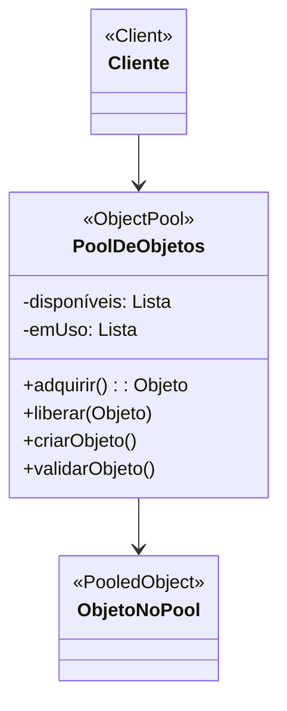

# Padrão de Projeto Pool de Objetos (Object Pool)

## Intenção

O padrão Pool de Objetos gerencia um conjunto de objetos inicializados mantidos prontos para uso, em vez de alocá-los e
destruí-los sob demanda. Isso é particularmente útil quando a inicialização de objetos é cara, ou quando objetos são
frequentemente necessários por curtas durações.

## Diagrama de Estrutura



## Participantes

- **PoolDeObjetos (ObjectPool)**: Gerencia objetos reutilizáveis, rastreando quais estão em uso e quais estão
  disponíveis
- **ObjetoNoPool (PooledObject)**: Objetos gerenciados pelo pool, frequentemente com métodos de ciclo de vida
- **Cliente (Client)**: Usa objetos do pool e os devolve quando termina

## Como Funciona

1. O PoolDeObjetos cria e mantém uma coleção de objetos reutilizáveis
2. Quando um cliente precisa de um objeto, ele solicita um do pool usando adquirir()
3. O pool fornece um objeto disponível ou cria um novo se necessário
4. Quando o cliente termina, ele devolve o objeto ao pool usando liberar()
5. O pool pode validar objetos quando são devolvidos para garantir que ainda estão utilizáveis

## Exemplo Prático: Pool de Conexões de Banco de Dados

Imagine uma aplicação web que precisa lidar com muitas operações de banco de dados concorrentemente. Conexões de banco
de dados são caras para criar, então reutilizá-las melhora o desempenho significativamente.

### Estrutura para o Pool de Conexões

- **PoolDeConexoes** (PoolDeObjetos): Gerencia um pool de conexões de banco de dados
- **Conexao** (ObjetoNoPool): Objetos de conexão de banco de dados que são reutilizados
- **ServicosAplicacao** (Cliente): Componentes da aplicação que precisam de acesso ao banco de dados

### Fluxo Conceitual

1. O PoolDeConexoes é inicializado quando a aplicação inicia, criando um conjunto de conexões
2. Quando um serviço precisa acessar o banco de dados, ele solicita uma conexão do pool
3. O pool fornece uma conexão disponível ou cria uma nova se todas estiverem em uso (até um limite máximo)
4. O serviço usa a conexão para realizar operações de banco de dados
5. Quando o serviço termina, ele retorna a conexão ao pool em vez de fechá-la
6. O pool verifica se a conexão ainda é válida antes de marcá-la como disponível novamente

### Cenário de Uso

- Inicialização do pool quando a aplicação é iniciada:
  ```java
  PoolDeConexoes pool = new PoolDeConexoes("jdbc:mysql://localhost/db", "usuario", "senha");
  pool.inicializar(10); // Cria 10 conexões iniciais
  ```
- Um serviço precisa de uma conexão:
  ```java
  Conexao conexao = pool.adquirir();
  try {
      // Usar a conexão para operações de banco de dados
      ResultSet rs = conexao.executarQuery("SELECT * FROM usuarios");
      // Processar resultados
  } finally {
      // Sempre devolver a conexão ao pool quando terminar
      pool.liberar(conexao);
  }
  ```

## Considerações de Implementação

1. **Estratégias de Crescimento e Encolhimento**:
    - Tamanho fixo: O pool tem um número fixo de objetos
    - Crescimento sob demanda: O pool cria novos objetos quando necessário até um limite
    - Encolhimento por tempo ocioso: O pool remove objetos não utilizados após um período

2. **Gerenciamento de Recursos**:
    - Inicialização preguiçosa vs. Inicialização antecipada
    - Validação de recursos antes de fornecê-los
    - Limpeza periódica de recursos inativos

3. **Tratamento de Concorrência**:
    - O pool deve ser thread-safe para uso em ambientes concorrentes
    - Bloqueio vs. Não-bloqueio quando todos os recursos estão em uso

4. **Validação e Recuperação**:
    - Verificar recursos quando eles são devolvidos ao pool
    - Descartar e substituir recursos inválidos
    - Reconexão automática para recursos que perdem conectividade

## Benefícios

- Melhora o desempenho reduzindo a sobrecarga de inicialização e destruição de objetos
- Controla o consumo de recursos, especialmente para recursos caros ou limitados
- Limita o número máximo de objetos que podem ser criados
- Recicla objetos que seriam descartados, reduzindo a pressão sobre o coletor de lixo
- Suaviza os picos de uso de recursos

## Desvantagens

- Aumenta a complexidade do código
- Pode levar a vazamentos de memória se os objetos não forem gerenciados corretamente
- Objetos no pool mantêm recursos mesmo quando não estão sendo usados ativamente
- Gerenciamento inadequado pode levar a esgotamento do pool ou contenção de recursos
- Debugging pode ser mais difícil devido ao compartilhamento de objetos

## Padrões Relacionados

- **Singleton**: Pools são frequentemente implementados como singletons
- **Factory Method**: Usado para criar novos objetos para o pool
- **Command**: Objetos Command podem ser reciclados em um pool
- **Prototype**: Pode ser usado para criar novos objetos no pool via clonagem
