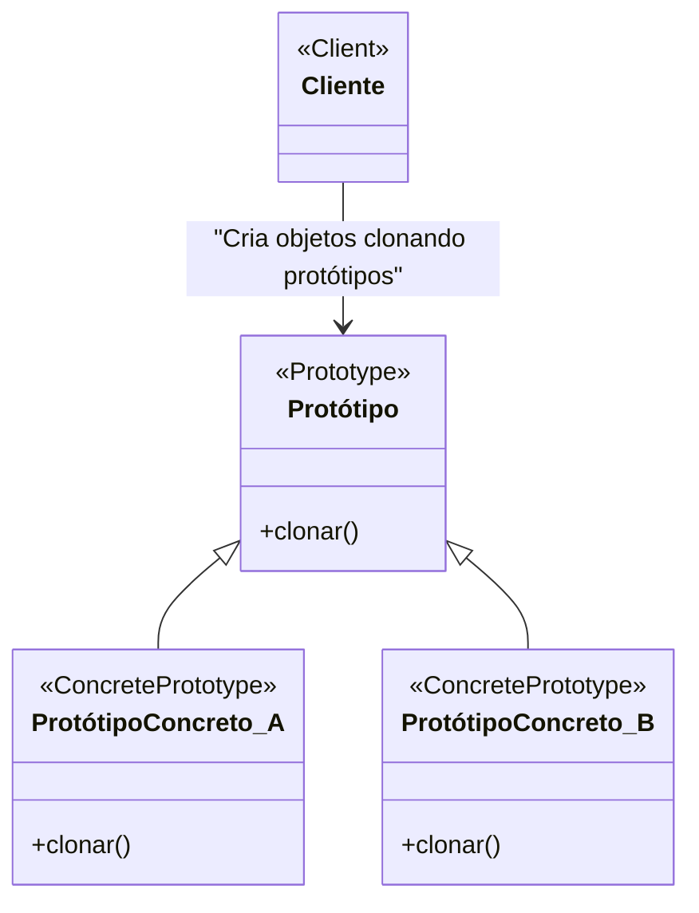

# Padrão de Projeto Protótipo (Prototype)

## Intenção

O padrão Protótipo especifica os tipos de objetos a serem criados usando uma instância prototípica, e cria novos objetos
copiando este protótipo.

## Diagrama de Estrutura



## Participantes

- **Protótipo (Prototype)**: Declara uma interface para clonar a si mesmo
- **ProtótipoConcreto (ConcretePrototype)**: Implementa a operação para clonar a si mesmo
- **Cliente (Client)**: Cria um novo objeto pedindo a um protótipo para clonar a si mesmo

## Como Funciona

1. Cada classe protótipo implementa uma operação de clonagem
2. O código cliente cria novos objetos clonando protótipos existentes
3. Novos objetos são cópias totalmente inicializadas que podem ser modificadas independentemente
4. Protótipos podem ser mantidos em um registro ou repositório para uso posterior

## Exemplo Prático: Editor Gráfico com Modelos de Formas

Imagine um editor gráfico que permite aos usuários criar documentos com várias formas. Usar formas pré-configuradas como
modelos agiliza o processo de criação.

### Estrutura para o Editor Gráfico

- **Forma** (Protótipo): Interface para todas as formas com um método clonar()
- **Círculo, Retângulo, Triângulo** (ProtótiposConcretos): Implementações concretas de formas que podem se clonar
- **Editor** (Cliente): Permite aos usuários criar novas formas clonando protótipos existentes

### Fluxo Conceitual

1. O editor mantém um conjunto de formas protótipos (pré-configuradas com propriedades como cores, bordas, etc.)
2. Quando um usuário quer criar uma nova forma, seleciona uma forma protótipo existente
3. O editor clona a forma protótipo para criar uma nova instância
4. O usuário pode modificar a nova forma sem afetar o protótipo original

### Cenário de Uso

- Inicialização do editor com formas protótipos:
  ```java
  RegistroProtótipos registro = new RegistroProtótipos();
  
  Círculo círculoProtótipo = new Círculo();
  círculoProtótipo.setRaio(50);
  círculoProtótipo.setCor("Vermelho");
  círculoProtótipo.setEstiloBorda("Pontilhado");
  registro.adicionar("círculoVermelho", círculoProtótipo);
  
  Retângulo retânguloProtótipo = new Retângulo();
  retânguloProtótipo.setLargura(100);
  retânguloProtótipo.setAltura(50);
  retânguloProtótipo.setCor("Azul");
  registro.adicionar("retânguloAzul", retânguloProtótipo);
  ```
- Um usuário quer criar um novo círculo vermelho:
  ```java
  Forma novaForma = registro.obter("círculoVermelho").clonar();
  // A novaForma é um círculo vermelho com raio 50 e borda pontilhada
  // O usuário pode modificar propriedades sem afetar o protótipo
  novaForma.moverPara(100, 200);
  ```

## Considerações de Implementação

1. **Clonagem Superficial vs. Profunda**:
    - Clonagem superficial: Copia apenas referências para objetos aninhados
    - Clonagem profunda: Cria novas cópias de todos os objetos aninhados
    - A escolha depende dos requisitos de independência entre protótipos e clones

2. **Registro de Protótipos**:
    - Um registro (ou catálogo) de protótipos facilita o acesso a protótipos por nome ou tipo
    - Permite adicionar novos protótipos dinamicamente sem alterar o código cliente

3. **Inicialização vs. Clonagem**:
    - Protótipos podem conter inicialização complexa que só precisa ser feita uma vez
    - A clonagem evita o custo da inicialização para cada nova instância

4. **Implementação da Clonagem**:
    - Em Java: Implementar a interface Cloneable e sobrescrever o método clone()
    - Em linguagens com reflexão: Usar reflexão para criar cópias de objetos
    - Em linguagens com serialização: Serializar e deserializar para criar cópias profundas

## Benefícios

- Reduz o número de subclasses
- Esconde a complexidade de criar objetos complexos
- Fornece alternativa à inicialização onerosa
- Permite adicionar e remover produtos em tempo de execução
- Especifica novos objetos variando valores e estrutura
- Reduz a necessidade de hierarquias de classes de fábrica

## Desvantagens

- Clonagem pode ser complexa para objetos com referências circulares
- Implementar clonagem profunda pode ser desafiador
- Pode introduzir problemas com identidade de objetos
- Cada classe protótipo deve implementar a operação de clonagem

## Padrões Relacionados

- **Abstract Factory**: Protótipos podem ser usados com Abstract Factory para construir fábricas a partir de protótipos
- **Composite**: Protótipos são úteis para clonar estruturas compostas
- **Decorator**: Pode ser usado com Prototype para criar variações de um objeto
- **Command**: Protótipos podem ser usados para manter um histórico de comandos para desfazer/refazer
