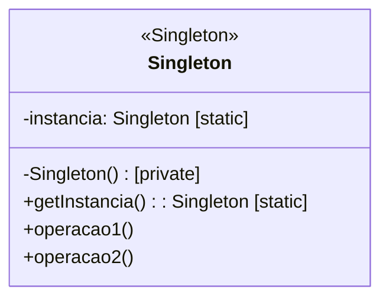

# Padrão de Projeto Singleton

## Intenção

O padrão Singleton garante que uma classe tenha apenas uma instância e fornece um ponto global de acesso a ela.

## Diagrama de Estrutura



## Participantes

- **Singleton**: A classe que tem um construtor privado e um método estático que retorna a única instância.

## Como Funciona

1. A classe Singleton declara um campo estático privado para manter a única instância
2. O construtor Singleton é tornado privado para impedir a instanciação direta
3. Um método estático público fornece acesso à instância, criando-a se ainda não existir
4. Todos os clientes usam o método estático para acessar a única instância

## Exemplo Prático: Gerenciador de Pool de Conexões de Banco de Dados

Imagine uma aplicação que precisa gerenciar um pool de conexões de banco de dados. Ter múltiplas instâncias poderia
levar a vazamentos de conexão ou conflitos.

### Estrutura para o Pool de Conexões de Banco de Dados

- **PoolDeConexoes** (Singleton): Gerencia um pool de conexões de banco de dados
- O pool rastreia conexões disponíveis e em uso
- O código cliente sempre acessa a mesma instância do pool

### Fluxo Conceitual

1. Quando a aplicação inicia, nenhum pool de conexões existe ainda
2. Na primeira vez que um componente precisa de uma conexão de banco de dados, ele chama `PoolDeConexoes.getInstancia()`
3. O método estático cria a única instância e a retorna
4. Chamadas subsequentes a `getInstancia()` retornam a instância existente
5. Todos os componentes compartilham o mesmo pool de conexões, garantindo gerenciamento adequado de recursos

### Cenário de Uso

```java
// Na classe PoolDeConexoes
public class PoolDeConexoes {
    private static PoolDeConexoes instancia;
    private final List<Conexao> conexoesDisponiveis;
    private final List<Conexao> conexoesEmUso;

    private PoolDeConexoes() {
        // Inicializa as listas e cria conexões iniciais
        conexoesDisponiveis = new ArrayList<>();
        conexoesEmUso = new ArrayList<>();
        // Criar conexões iniciais...
    }

    public static synchronized PoolDeConexoes getInstancia() {
        if (instancia == null) {
            instancia = new PoolDeConexoes();
        }
        return instancia;
    }

    public synchronized Conexao obterConexao() {
        // Lógica para fornecer uma conexão...
    }

    public synchronized void liberarConexao(Conexao conexao) {
        // Lógica para retornar uma conexão ao pool...
    }
}
```

- No código cliente, em qualquer parte da aplicação:
  ```java
  PoolDeConexoes pool = PoolDeConexoes.getInstancia();
  Conexao conexao = pool.obterConexao();
  // Usar a conexão...
  pool.liberarConexao(conexao);
  ```

## Considerações de Implementação

1. **Inicialização Preguiçosa vs. Antecipada**:
    - Inicialização preguiçosa: A instância é criada na primeira chamada a getInstancia()
    - Inicialização antecipada: A instância é criada quando a classe é carregada

2. **Segurança em Threads**:
    - Synchronized: Adicione synchronized ao método getInstancia() para ambientes multi-thread
    - Inicialização estática: Use inicialização estática para segurança em threads (inicialização antecipada)
    - Verificação dupla com bloqueio: Otimiza para minimizar o overhead de sincronização

3. **Proteção contra Reflexão e Serialização**:
    - Proteção contra reflexão: Lançar exceção no construtor se a instância já existir
    - Proteção contra serialização: Implementar readResolve() para controlar a deserialização

4. **Variações de Implementação**:
    - Singleton com enum: Solução mais simples em Java com segurança em threads e proteção contra serialização
    - Singleton com inicialização sob demanda: Usa classes internas para inicialização preguiçosa segura para threads

## Benefícios

- Acesso controlado à única instância
- Namespace reduzido (apenas um nome global)
- Permite refinamento de operações e representação
- Permite variação no número de instâncias
- Mais flexível que operações de classe (estáticas)

## Desvantagens

- Dificulta o teste unitário devido ao estado global
- Introduz acoplamento em toda a aplicação
- Viola o princípio de responsabilidade única
- Pode ocultar dependências, tornando o design menos transparente
- Requer considerações especiais em ambientes concorrentes

## Padrões Relacionados

- **Abstract Factory**, **Builder**, **Prototype**: Estes padrões podem ser implementados como Singletons
- **Facade**: Frequentemente implementado como Singleton quando apenas uma fachada é necessária
- **State**: Objetos State podem ser implementados como Singletons
- **Multiton**: Extensão do Singleton que mantém um mapa de instâncias nomeadas
