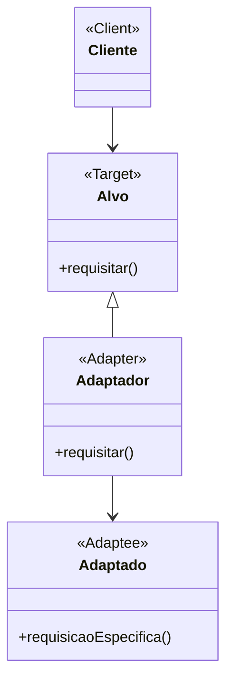

# Padrão de Projeto Adaptador (Adapter)

## Intenção

O padrão Adaptador converte a interface de uma classe em outra interface que os clientes esperam. Ele permite que
classes trabalhem juntas que, de outra forma, não poderiam devido a interfaces incompatíveis.

## Diagrama de Estrutura



## Participantes

- **Alvo (Target)**: Define a interface específica do domínio que o Cliente usa
- **Cliente (Client)**: Colabora com objetos que estão em conformidade com a interface Alvo
- **Adaptado (Adaptee)**: Define uma interface existente que precisa ser adaptada
- **Adaptador (Adapter)**: Adapta a interface do Adaptado para a interface Alvo

## Como Funciona

1. O Cliente chama operações em uma instância do Adaptador
2. O Adaptador chama operações do Adaptado que realizam a solicitação, traduzindo entre interfaces conforme necessário
3. O Cliente não precisa conhecer o Adaptado, ele trabalha apenas com a interface Alvo

## Exemplo Prático: Adaptador de Interface de Banco de Dados

Imagine uma aplicação que precisa trabalhar com vários sistemas de banco de dados, cada um com suas próprias APIs (
MySQL, MongoDB, etc.), mas você deseja fornecer uma interface consistente para sua aplicação.

### Estrutura para Adaptador de Banco de Dados

- **BancoDados** (Alvo): Interface comum que sua aplicação usa para operações de banco de dados
- **MySQLAPI, MongoDBAPI** (Adaptados): APIs específicas dos sistemas de banco de dados
- **AdaptadorMySQL, AdaptadorMongoDB** (Adaptadores): Adaptam as APIs específicas para a interface comum

### Fluxo Conceitual

1. Sua aplicação usa apenas a interface BancoDados
2. Quando a aplicação chama métodos como `consultar()` ou `inserir()`
3. O adaptador apropriado converte essas chamadas para o formato específico da API do banco de dados
4. Por exemplo, `consultar()` pode ser convertido para `executeQuery()` no MySQL ou `find()` no MongoDB

### Cenário de Uso

- Configuração do adaptador para MySQL:
  ```java
  MySQLAPI mysql = new MySQLAPI("localhost", "root", "password");
  BancoDados db = new AdaptadorMySQL(mysql);
  ```
- Usar a interface comum para operações:
  ```java
  List<Registro> registros = db.consultar("SELECT * FROM usuarios");
  ```
- Alternar para MongoDB apenas mudando o adaptador:
  ```java
  MongoDBAPI mongo = new MongoDBAPI("mongodb://localhost");
  BancoDados db = new AdaptadorMongoDB(mongo);
  // Usar exatamente as mesmas chamadas de método
  List<Registro> registros = db.consultar("usuarios");
  ```

## Considerações de Implementação

1. **Adaptador de Classe vs. Adaptador de Objeto**:
    - Adaptador de Classe: Usa herança para adaptar uma classe para outra (requer herança múltipla em algumas
      linguagens)
    - Adaptador de Objeto: Usa composição para referenciar o objeto adaptado (mais flexível e preferido em Java)

2. **Adaptação Bidirecional**:
    - Alguns adaptadores precisam funcionar em ambas as direções
    - Permite que clientes trabalhem com interfaces diferentes transparentemente

3. **Adaptador Pluggable**:
    - Projetado para ser trocado em tempo de execução
    - Útil para sistemas com configurações variáveis ou para testes

4. **Profundidade da Adaptação**:
    - Adaptadores simples apenas encaminham chamadas de método
    - Adaptadores complexos podem realizar transformações significativas de dados ou comportamento

## Benefícios

- Permite que classes com interfaces incompatíveis trabalhem juntas
- Reutiliza classes existentes que não têm interfaces compatíveis
- Separa a interface da implementação, melhorando a manutenção
- Isola o cliente de alterações em sistemas adaptados
- Promove o princípio aberto/fechado: adicione adaptadores sem modificar código existente

## Desvantagens

- Aumenta a complexidade adicionando um nível de indireção
- Às vezes requer um grande número de adaptadores para cobrir todas as funcionalidades
- Pode introduzir sobrecarga de desempenho em operações frequentes
- Pode ser mais limpo redesenhar o componente Adaptado, se possível

## Padrões Relacionados

- **Bridge**: Semelhante ao Adapter, mas usado desde o início do design para separar interface e implementação
- **Decorator**: Adiciona responsabilidades a objetos sem alterar sua interface, enquanto Adapter altera a interface
- **Proxy**: Representa outro objeto, enquanto Adapter muda sua interface
- **Facade**: Simplifica uma interface sem adaptação, fornecendo uma interface unificada para um conjunto de interfaces
