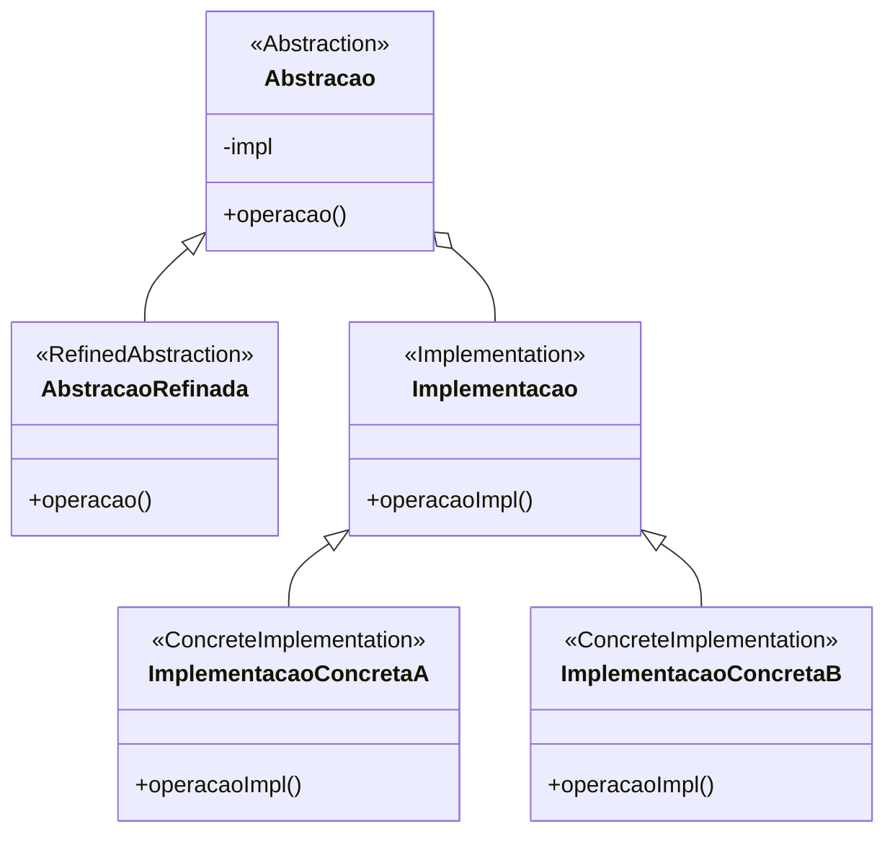

# Padrão de Projeto Ponte (Bridge)

## Intenção

O padrão Ponte desacopla uma abstração de sua implementação, de modo que as duas possam variar independentemente.

## Diagrama de Estrutura



## Participantes

- **Abstração (Abstraction)**: Define a interface da abstração e mantém uma referência a um objeto de Implementação
- **AbstraçãoRefinada (RefinedAbstraction)**: Estende a interface definida pela Abstração
- **Implementação (Implementation)**: Define a interface para classes de implementação
- **ImplementaçãoConcreta (ConcreteImplementation)**: Implementa a interface de Implementação

## Como Funciona

1. A Abstração define operações de alto nível e mantém uma referência a um objeto de Implementação
2. O código cliente interage com a Abstração
3. A Abstração delega operações específicas de implementação para seu objeto de Implementação
4. Esta separação permite que tanto as hierarquias de Abstração quanto de Implementação evoluam independentemente

## Exemplo Prático: Aplicação de Desenho

Imagine uma aplicação de desenho que precisa renderizar diferentes formas (círculos, quadrados) em diferentes
plataformas (Windows, macOS, Linux).

### Estrutura para Aplicação de Desenho

- **Forma** (Abstração): Classe abstrata representando formas com operações como desenhar, redimensionar
- **Círculo, Quadrado** (AbstraçõesRefinadas): Tipos específicos de formas com seu próprio comportamento
- **Renderizador** (Implementação): Interface para operações de renderização
- **RenderizadorWindows, RenderizadorMacOS, RenderizadorLinux** (ImplementaçõesConcretas): Implementam a renderização
  para plataformas específicas

### Fluxo Conceitual

1. O cliente cria uma forma (Círculo, Quadrado) e fornece um renderizador específico
2. Quando o cliente chama `forma.desenhar()`, a forma usa seu renderizador para realizar a renderização real
3. Diferentes formas podem ter comportamentos específicos, mas todas usam o renderizador para operações de plataforma
4. Novas formas podem ser adicionadas sem modificar os renderizadores, e vice-versa

### Cenário de Uso

- Criar um círculo que será renderizado no Windows:
  ```java
  Renderizador renderizador = new RenderizadorWindows();
  Forma circulo = new Circulo(5, 10, 50, renderizador);
  circulo.desenhar();  // Desenha um círculo no Windows
  ```
- Para mudar para macOS, apenas troque o renderizador:
  ```java
  Renderizador renderizador = new RenderizadorMacOS();
  Forma circulo = new Circulo(5, 10, 50, renderizador);
  circulo.desenhar();  // Desenha um círculo no macOS
  ```
- Adicionar um novo tipo de forma não afeta os renderizadores:
  ```java
  Forma triangulo = new Triangulo(points, renderizador);
  triangulo.desenhar();  // Usa o mesmo renderizador
  ```

## Considerações de Implementação

1. **Criando a Abstração**:
    - Decida quais operações devem pertencer à abstração
    - Determine quais operações devem ser delegadas à implementação

2. **Hierarquia de Implementação**:
    - Defina a interface de implementação com operações primitivas
    - Operações de abstração são implementadas em termos dessas primitivas
    - Considere usar uma implementação padrão

3. **Compartilhamento de Implementações**:
    - Múltiplas abstrações podem compartilhar a mesma implementação
    - Um mecanismo de referência contada pode ser útil para gerenciar recursos

4. **Implementação sob Demanda**:
    - A implementação pode ser selecionada ou trocada em tempo de execução
    - Padrões como Factory Method podem ser usados para criar a implementação apropriada

## Benefícios

- Separa interface de implementação
- Melhora a extensibilidade: Abstração e implementação podem ser estendidas independentemente
- Esconde detalhes de implementação dos clientes
- Permite troca dinâmica de implementações
- Promove o princípio de composição sobre herança

## Desvantagens

- Aumenta a complexidade do código
- Pode ser excessivo para designs simples
- Dificulta a compreensão da relação entre abstração e implementação
- Pode tornar o depuração mais complicada devido à indireção adicional

## Padrões Relacionados

- **Abstract Factory**: Pode criar e configurar uma Bridge
- **Adapter**: Adapta interfaces existentes, enquanto Bridge é projetado desde o início para permitir variações
- **Strategy**: Semelhante a Bridge, mas focado em algoritmos intercambiáveis em vez de implementações
- **Composite**: Pode ser usado com Bridge para criar uma hierarquia de abstrações compostas
