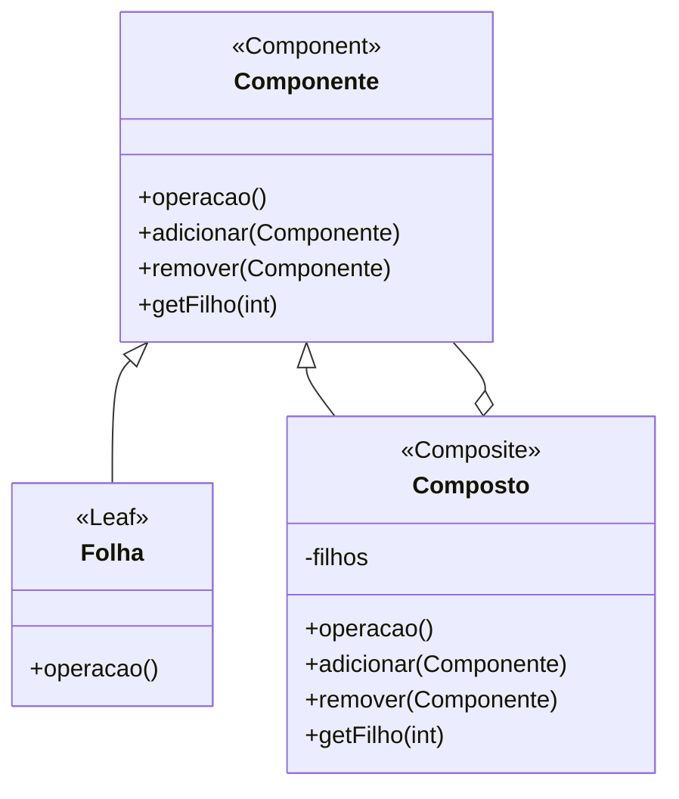

# Padrão de Projeto Composto (Composite)

## Intenção

O padrão Composto compõe objetos em estruturas de árvore para representar hierarquias parte-todo. Ele permite que os
clientes tratem objetos individuais e composições de objetos de maneira uniforme.

## Diagrama de Estrutura



## Participantes

- **Componente (Component)**: Declara a interface para objetos na composição e implementa comportamento padrão
- **Folha (Leaf)**: Representa objetos folha na composição (não tem filhos)
- **Composto (Composite)**: Define comportamento para componentes que têm filhos e armazena componentes filhos
- **Cliente (Client)**: Manipula objetos na composição através da interface Componente

## Como Funciona

1. A interface Componente fornece operações comuns tanto para elementos simples quanto complexos da árvore
2. Folha implementa a interface Componente para objetos simples que não têm filhos
3. Composto implementa a interface Componente para objetos complexos que podem ter filhos
4. Composto encaminha operações para componentes filhos e pode realizar operações adicionais
5. Clientes usam a interface Componente para interagir com todos os objetos na estrutura composta

## Exemplo Prático: Explorador de Sistema de Arquivos

Imagine um explorador de sistema de arquivos que precisa representar tanto arquivos individuais quanto diretórios que
contêm outros arquivos e diretórios.

### Estrutura para o Explorador de Arquivos

- **ArquivoSistema** (Componente): Interface para todos os itens do sistema de arquivos
- **Arquivo** (Folha): Representa um único arquivo que não contém outros itens
- **Diretório** (Composto): Representa um diretório que pode conter arquivos e outros diretórios

### Fluxo Conceitual

1. O cliente trabalha com um ArquivoSistema sem se preocupar se é um Arquivo ou Diretório
2. Quando o cliente chama operações como `exibir()` ou `calcularTamanho()`, elas funcionam corretamente para ambos os
   tipos
3. Em um Arquivo, as operações funcionam diretamente no arquivo individual
4. Em um Diretório, as operações são delegadas para todos os filhos e os resultados são combinados apropriadamente

### Cenário de Uso

- Criar uma estrutura de arquivos:
  ```java
  ArquivoSistema raiz = new Diretorio("raiz");
  ArquivoSistema docs = new Diretorio("documentos");
  ArquivoSistema arquivo1 = new Arquivo("relatorio.pdf", 1024);
  ArquivoSistema arquivo2 = new Arquivo("imagem.jpg", 2048);
  
  docs.adicionar(arquivo1);
  raiz.adicionar(docs);
  raiz.adicionar(arquivo2);
  ```
- Calcular o tamanho total:
  ```java
  long tamanhoTotal = raiz.calcularTamanho();  // Retorna 3072 (1024 + 2048)
  ```
- Exibir a estrutura completa:
  ```java
  raiz.exibir();  // Mostra a estrutura hierárquica completa
  ```

## Considerações de Implementação

1. **Interface vs. Classe Abstrata**:
    - Interface: Oferece mais flexibilidade, mas menos suporte para implementações padrão
    - Classe abstrata: Permite comportamento padrão compartilhado

2. **Gerenciamento de Filhos**:
    - Decida onde implementar operações de gerenciamento de filhos (adicionar, remover)
    - Na classe Component: Simplifica o cliente, mas Leaf precisa implementar operações vazias
    - Apenas na classe Composite: Mais seguro, mas clientes precisam verificar o tipo antes de chamar

3. **Ordenação de Filhos**:
    - Escolha a estrutura de dados apropriada para armazenar filhos (lista, conjunto, mapa)
    - Considere requisitos de ordem, acesso aleatório, unicidade

4. **Caching vs. Recálculo**:
    - Para operações caras que percorrem a árvore, considere armazenar em cache os resultados
    - Equilíbrio entre desempenho e consistência

## Benefícios

- Simplifica o código do cliente ao tratar objetos individuais e composições uniformemente
- Facilita a adição de novos tipos de componentes
- Encoraja designs recursivos que são naturais para estruturas hierárquicas
- Adere ao princípio aberto/fechado: Novos componentes podem ser adicionados sem modificar código existente
- Representação natural para hierarquias parte-todo

## Desvantagens

- Pode tornar o design muito genérico, dificultando a imposição de restrições
- Pode complicar o tratamento de erros e validações
- Componentes compostos delegando para muitos filhos podem ter problemas de desempenho
- Remoção de componentes pode ser complexa se referências bidirecionais forem mantidas

## Padrões Relacionados

- **Decorator**: Adiciona responsabilidades a objetos individuais, enquanto Composite adiciona comportamento a
  hierarquias inteiras
- **Chain of Responsibility**: Frequentemente usado com Composite para propagar solicitações através da estrutura de
  árvore
- **Iterator**: Útil para percorrer estruturas Composite sem expor sua estrutura interna
- **Visitor**: Permite definir novas operações para estruturas Composite sem mudar as classes dos elementos
