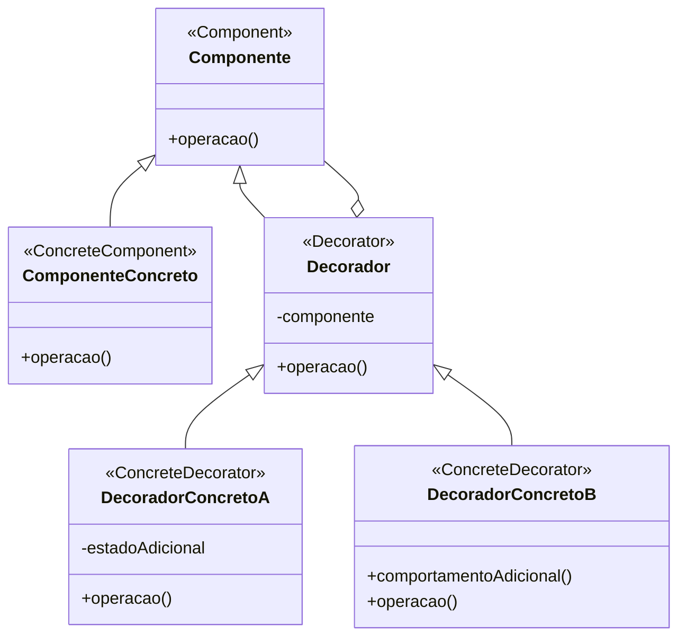

# Padrão de Projeto Decorador (Decorator)

## Intenção

O padrão Decorador anexa responsabilidades adicionais a um objeto dinamicamente. Decoradores fornecem uma alternativa
flexível à herança para estender funcionalidades.

## Diagrama de Estrutura



## Participantes

- **Componente (Component)**: Define a interface para objetos que podem ter responsabilidades adicionadas dinamicamente
- **ComponenteConcreto (ConcreteComponent)**: Define um objeto ao qual responsabilidades adicionais podem ser anexadas
- **Decorador (Decorator)**: Mantém uma referência a um objeto Componente e define uma interface que está em
  conformidade com a interface do Componente
- **DecoradorConcreto (ConcreteDecorator)**: Adiciona responsabilidades ao componente

## Como Funciona

1. O Decorador implementa a mesma interface que o Componente que ele decora
2. O Decorador mantém uma referência a um objeto Componente
3. O Decorador encaminha solicitações para o Componente
4. O Decorador pode realizar operações adicionais antes ou depois de encaminhar a solicitação
5. Os decoradores podem ser aninhados, permitindo a combinação de comportamentos

## Exemplo Prático: Sistema de Notificação

Imagine um sistema de notificação que precisa suportar diferentes canais de entrega (e-mail, SMS, notificações push) e
funcionalidades adicionais (formatação HTML, criptografia, compressão).

### Estrutura para o Sistema de Notificação

- **Notificador** (Componente): Interface para todos os notificadores
- **NotificadorEmail** (ComponenteConcreto): Implementação básica para enviar notificações por e-mail
- **NotificadorDecorador** (Decorador): Classe base para todos os decoradores de notificação
- **DecoradorHTML, DecoradorCriptografia, DecoradorCompressao** (DecoradoresConcretos): Adicionam funcionalidades
  específicas

### Fluxo Conceitual

1. Um cliente cria um notificador base (por exemplo, NotificadorEmail)
2. O cliente envolve o notificador base com decoradores para adicionar funcionalidades
3. O cliente usa o notificador decorado como se fosse o notificador original
4. Cada decorador realiza sua funcionalidade específica e delega para o próximo na cadeia

### Cenário de Uso

- Criar um notificador de e-mail básico:
  ```java
  Notificador notificador = new NotificadorEmail("admin@exemplo.com");
  ```
- Decorar o notificador com formatação HTML:
  ```java
  notificador = new DecoradorHTML(notificador);
  ```
- Adicionar criptografia:
  ```java
  notificador = new DecoradorCriptografia(notificador);
  ```
- Usar o notificador composto:
  ```java
  notificador.enviar("Alerta de Segurança", "Tentativa de login suspeita detectada.");
  ```
- Internamente, o fluxo é:
    1. DecoradorCriptografia criptografa a mensagem
    2. DecoradorHTML formata a mensagem criptografada com tags HTML
    3. NotificadorEmail envia o e-mail formatado e criptografado

## Considerações de Implementação

1. **Interface vs. Herança**:
    - Interface: Mais flexível, permite decorar qualquer implementação da interface
    - Herança concreta: Mais simples, mas limita o que pode ser decorado

2. **Ordem de Decoração**:
    - A ordem em que os decoradores são aplicados pode afetar o resultado final
    - Considere documentar ou fornecer métodos de fábrica para combinações comuns

3. **Manutenção de Estado**:
    - Decoradores podem manter estado adicional
    - Considere como o estado é afetado quando decoradores são combinados

4. **Identidade de Objeto**:
    - Decoradores mudam a identidade do objeto original
    - Testes de identidade (==) falharão, use equals() bem implementado

## Benefícios

- Maior flexibilidade que a herança estática
- Evita classes sobrecarregadas com recursos no topo da hierarquia
- Permite adicionar ou remover responsabilidades em tempo de execução
- Permite combinar múltiplos comportamentos usando composição
- Princípio de responsabilidade única: Cada decorador lida com uma única funcionalidade

## Desvantagens

- Resulta em muitos objetos pequenos que se parecem
- Difícil de remover um decorador específico da pilha
- Implementação inicial mais complexa
- Pode ser difícil depurar devido à estrutura em camadas
- A ordem de aplicação dos decoradores pode ser importante e não óbvia

## Padrões Relacionados

- **Adapter**: Muda a interface de um objeto, enquanto Decorator mantém a mesma interface enquanto adiciona
  responsabilidades
- **Composite**: Decorator pode ser visto como um Composite com apenas um componente, ambos seguem o princípio de
  recursão
- **Strategy**: Decorator muda o "como" de um objeto por fora, Strategy muda o "como" por dentro
- **Chain of Responsibility**: Semelhante ao Decorator, mas geralmente apenas um handler na cadeia lida com a
  solicitação
