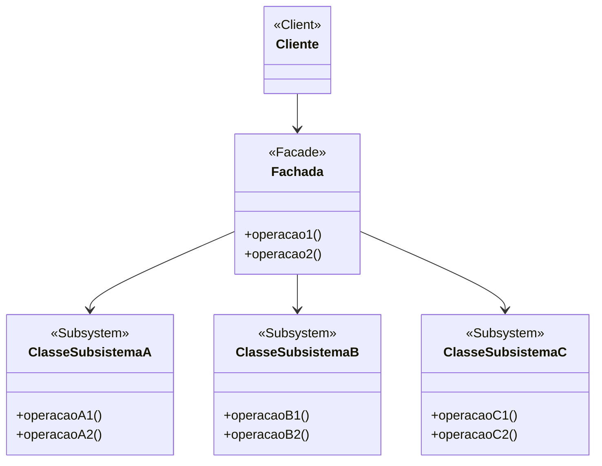

# Padrão de Projeto Fachada (Facade)

## Intenção

O padrão Fachada fornece uma interface unificada para um conjunto de interfaces em um subsistema. Ele define uma
interface de nível mais alto que torna o subsistema mais fácil de usar, reduzindo a complexidade e ocultando a
comunicação e dependências entre subsistemas.

## Diagrama de Estrutura



## Participantes

- **Fachada (Facade)**: Fornece uma interface simplificada para o subsistema
- **Classes do Subsistema (Subsystem Classes)**: Implementam a funcionalidade do subsistema e lidam com o trabalho
  atribuído pela Fachada
- **Cliente (Client)**: Usa a Fachada para interagir com o subsistema

## Como Funciona

1. A Fachada fornece uma interface simples para um subsistema complexo
2. A Fachada delega solicitações do cliente para objetos apropriados do subsistema
3. Os objetos do subsistema realizam o trabalho real
4. O cliente é protegido da complexidade do subsistema

## Exemplo Prático: Sistema de Home Theater

Imagine um sistema de home theater com múltiplos componentes como DVD player, projetor, sistema de som e luzes. Usar
cada componente individualmente seria complexo.

### Estrutura para o Sistema de Home Theater

- **FachadaHomeTheater** (Fachada): Fornece métodos simples como assistirFilme(), ouvirMusica()
- **DVDPlayer, Projetor, SistemaSom, ControleLuzes** (Subsistema): Componentes individuais com operações específicas

### Fluxo Conceitual

1. O cliente quer assistir a um filme, mas isso envolve muitas etapas com componentes individuais
2. Em vez disso, o cliente chama `fachadaHomeTheater.assistirFilme("Matrix")`
3. A fachada coordena internamente todos os componentes:
    - Liga o sistema de som
    - Liga o DVD player e carrega o filme
    - Liga o projetor e configura a entrada
    - Escurece as luzes
    - Inicia a reprodução do filme

### Cenário de Uso

- Sem a fachada, assistir a um filme seria assim:
  ```java
  dvdPlayer.ligar();
  dvdPlayer.carregarFilme("Matrix");
  projetor.ligar();
  projetor.configurarEntrada(DVDPlayer);
  projetor.configurarModoWidescreen();
  sistemaSom.ligar();
  sistemaSom.configurarVolume(10);
  sistemaSom.configurarModoSurround();
  luzes.escurecer(10);
  dvdPlayer.reproduzir();
  ```
- Com a fachada, o mesmo processo fica:
  ```java
  fachadaHomeTheater.assistirFilme("Matrix");
  ```
- E quando o filme termina:
  ```java
  fachadaHomeTheater.encerrarFilme();
  ```

## Considerações de Implementação

1. **Nível de Abstração**:
    - Decida o nível apropriado de abstração para a fachada
    - Muito abstrato: Pode limitar a flexibilidade
    - Muito detalhado: Pode expor demais a complexidade do subsistema

2. **Fachadas Múltiplas**:
    - Considere criar múltiplas fachadas para diferentes aspectos do subsistema
    - Evite criar uma "super fachada" que faz demais

3. **Acesso Direto ao Subsistema**:
    - Decida se o cliente também deve ter acesso direto aos componentes do subsistema
    - A fachada não precisa encapsular completamente o subsistema

4. **Estado da Fachada**:
    - A fachada pode manter estado para rastrear o estado atual do subsistema
    - Útil para coordenar transições complexas entre estados do subsistema

## Benefícios

- Simplifica o uso de subsistemas complexos
- Promove o baixo acoplamento entre clientes e subsistemas
- Camada de isolamento que pode ajudar na migração ou refatoração do subsistema
- Fornece um ponto de entrada unificado para um subsistema
- Encapsula sequências de operações complexas em métodos de alto nível

## Desvantagens

- Pode se tornar um objeto "deus" que faz demais
- Pode ocultar excessivamente a complexidade do subsistema, dificultando a personalização
- Introduz uma camada adicional que pode afetar o desempenho
- Pode limitar as opções disponíveis para o cliente
- Pode criar dependência desnecessária se o subsistema for realmente simples

## Padrões Relacionados

- **Abstract Factory**: Pode ser usado com Facade para fornecer uma interface para criar subsistemas
- **Mediator**: Similar ao Facade, mas o Mediator centraliza a comunicação entre colegas, enquanto Facade simplifica a
  interface para um subsistema
- **Singleton**: Fachadas são frequentemente implementadas como singletons
- **Adapter**: Adapter adapta uma interface existente, enquanto Facade define uma nova interface
