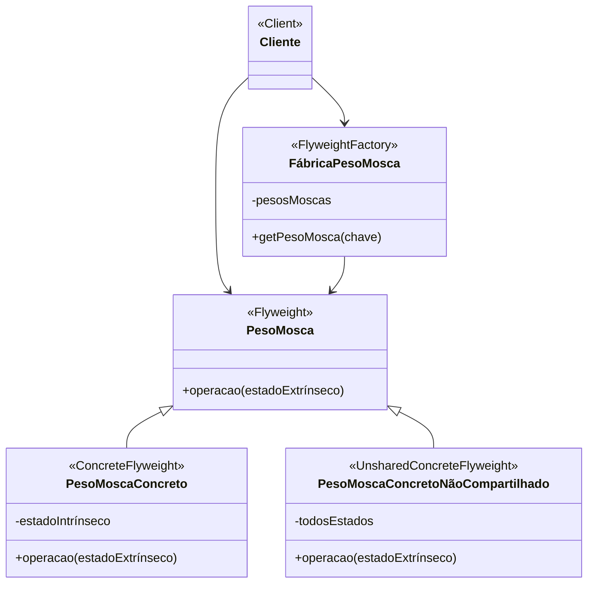

# Padrão de Projeto Peso-Mosca (Flyweight)

## Intenção

O padrão Peso-Mosca usa compartilhamento para suportar grandes números de objetos de granularidade fina de forma
eficiente. Ele minimiza o uso de memória compartilhando o máximo de dados possível entre objetos similares.

## Diagrama de Estrutura



## Participantes

- **PesoMosca (Flyweight)**: Declara uma interface através da qual os pesos-mosca podem receber e agir sobre estado
  extrínseco
- **PesoMoscaConcreto (ConcreteFlyweight)**: Implementa a interface PesoMosca e armazena estado intrínseco
- **PesoMoscaConcretoNãoCompartilhado (UnsharedConcreteFlyweight)**: Nem todas as subclasses de PesoMosca precisam ser
  compartilhadas
- **FábricaPesoMosca (FlyweightFactory)**: Cria e gerencia objetos peso-mosca e garante que sejam compartilhados
  adequadamente
- **Cliente (Client)**: Mantém referências a pesos-mosca e calcula ou armazena estado extrínseco

## Como Funciona

1. Separe o estado do objeto em:
    - Estado intrínseco: Informação compartilhada armazenada no peso-mosca
    - Estado extrínseco: Informação que varia entre objetos, passada para o peso-mosca quando uma operação é chamada
2. A FábricaPesoMosca gerencia o pool de objetos PesoMosca compartilhados
3. Quando um cliente solicita um peso-mosca, a fábrica retorna uma instância existente ou cria uma nova se necessário
4. Os clientes armazenam ou calculam o estado extrínseco e o passam para os pesos-mosca

## Exemplo Prático: Editor de Texto

Imagine um editor de texto que precisa renderizar milhares de caracteres. Sem compartilhamento, cada caractere
consumiria memória para armazenar dados como a fonte, tamanho, etc.

### Estrutura para o Editor de Texto

- **Caractere** (PesoMosca): Interface para objetos de caracteres
- **CaractereConcreto** (PesoMoscaConcreto): Contém informações intrínsecas como a fonte e o estilo
- **FábricaCaractere** (FábricaPesoMosca): Gerencia caracteres compartilhados
- **Editor** (Cliente): Usa caracteres e mantém o estado extrínseco como posição e cor

### Fluxo Conceitual

1. Quando o editor precisa renderizar um caractere, ele solicita à fábrica um objeto de caractere para o código de
   caractere específico
2. A fábrica retorna um objeto CaractereConcreto existente ou cria um novo se necessário
3. O editor mantém a posição (x, y) e a cor como estado extrínseco
4. Quando o caractere é renderizado, o editor passa o estado extrínseco para o objeto de caractere
5. O objeto de caractere usa seu estado intrínseco (fonte, estilo) junto com o estado extrínseco (posição, cor) para se
   renderizar

### Cenário de Uso

- Inicialização do editor:
  ```java
  FábricaCaractere fábrica = new FábricaCaractere();
  Editor editor = new Editor(fábrica);
  ```
- Renderização de texto:
  ```java
  String texto = "Hello, World!";
  int x = 10, y = 20;
  Cor cor = Cor.PRETO;
  
  for (char c : texto.toCharArray()) {
      Caractere caractere = fábrica.getCaractere(c);
      editor.desenharCaractere(caractere, x, y, cor);
      x += caractere.getLargura();  // Avança a posição horizontal
  }
  ```
- Internamente, a fábrica mantém apenas um objeto para cada caractere único:
  ```java
  // Na classe FábricaCaractere:
  public Caractere getCaractere(char código) {
      if (!caracteres.containsKey(código)) {
          caracteres.put(código, new CaractereConcreto(código, fontePadrão, estiloPadrão));
      }
      return caracteres.get(código);
  }
  ```

## Considerações de Implementação

1. **Gerenciamento de Estado**:
    - Identifique claramente o estado intrínseco vs. extrínseco
    - Torne o estado intrínseco imutável para evitar inconsistências
    - Projete APIs para passar eficientemente o estado extrínseco

2. **Fábrica de Pesos-Mosca**:
    - Use uma tabela hash para armazenar e recuperar pesos-mosca
    - Considere políticas de reclamação de memória para remover pesos-mosca não utilizados
    - A fábrica geralmente é implementada como um singleton

3. **Compartilhamento vs. Desempenho**:
    - Balance o compartilhamento de objetos contra o custo de passagem de estado extrínseco
    - Considere mesclar estados extrínsecos comuns em novos pesos-mosca para casos de uso frequentes

4. **Sincronização**:
    - Em ambientes multithread, a fábrica deve sincronizar o acesso ao pool de pesos-mosca
    - Considere bloqueio por estágio ou outras estratégias de concorrência para melhorar o desempenho

## Benefícios

- Reduz significativamente o número de objetos criados
- Diminui os requisitos de memória e armazenamento
- Melhora o desempenho em sistemas com grandes números de objetos
- Permite que mais objetos sejam manipulados dentro dos limites de memória disponíveis
- Centraliza o estado em menos objetos, facilitando o gerenciamento

## Desvantagens

- Introduz complexidade na distinção entre estado intrínseco e extrínseco
- Transfere a complexidade para o código cliente que deve gerenciar o estado extrínseco
- Pode introduzir sobrecarga de desempenho devido à busca e passagem de estado extrínseco
- Pode complicar a depuração devido ao compartilhamento de objetos
- Dificulta a adição de comportamento específico de instância

## Padrões Relacionados

- **Composite**: Flyweights podem ser usados como folhas em uma estrutura Composite
- **State**, **Strategy**: Objetos flyweight frequentemente implementam estes padrões
- **Singleton**: A fábrica flyweight geralmente é implementada como singleton
- **Factory Method**: Usado dentro da fábrica flyweight para criar pesos-mosca
- **Proxy**: Semelhante ao flyweight, mas com propósito de controlar acesso, não compartilhamento
