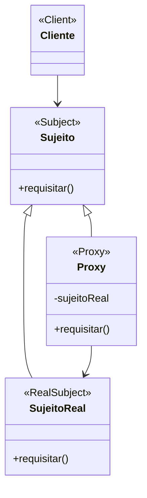

# Padrão de Projeto Proxy

## Intenção

O padrão Proxy fornece um substituto ou marcador para outro objeto para controlar o acesso a ele.

## Diagrama de Estrutura



## Participantes

- **Sujeito (Subject)**: Interface que define operações comuns para SujeitoReal e Proxy
- **SujeitoReal (RealSubject)**: O objeto real que o proxy representa
- **Proxy**: Mantém uma referência ao SujeitoReal e controla o acesso a ele
- **Cliente (Client)**: Interage com o SujeitoReal através do Proxy

## Como Funciona

1. O Proxy implementa a mesma interface que o SujeitoReal
2. O Cliente interage com o Proxy como se fosse o SujeitoReal
3. O Proxy mantém uma referência ao SujeitoReal e encaminha solicitações para ele quando apropriado
4. O Proxy pode realizar operações adicionais antes ou depois de encaminhar solicitações

## Exemplo Prático: Sistema de Carregamento de Imagens

Imagine um aplicativo visualizador de imagens que precisa exibir um grande número de imagens de alta resolução. Carregar
todas as imagens de uma vez consumiria muita memória.

### Estrutura para o Sistema de Imagens

- **Imagem** (Sujeito): Interface com métodos como exibir()
- **ImagemReal** (SujeitoReal): Imagem real que carrega os dados da imagem do disco e a renderiza
- **ProxyImagem** (Proxy): Marcador que só carrega a imagem real quando ela é realmente exibida

### Fluxo Conceitual

1. A interface do usuário cria objetos ProxyImagem para cada imagem na galeria
2. Inicialmente, a ProxyImagem exibe apenas um espaço reservado ou thumbnail de baixa resolução
3. Quando o usuário seleciona uma imagem para visualização, a ProxyImagem cria um objeto ImagemReal sob demanda
4. O objeto ImagemReal carrega e renderiza a imagem de alta resolução
5. A ProxyImagem pode armazenar em cache o objeto ImagemReal para uso futuro

### Cenário de Uso

- Carregar uma galeria de imagens:
  ```java
  List<Imagem> galeria = new ArrayList<>();
  for (String arquivo : listaDeArquivos) {
      galeria.add(new ProxyImagem(arquivo));
  }
  ```
- Exibir todas as imagens (apenas thumbnails são carregados inicialmente):
  ```java
  for (Imagem imagem : galeria) {
      imagem.exibirThumbnail();  // Não carrega a imagem completa
  }
  ```
- Quando um usuário seleciona uma imagem:
  ```java
  Imagem imagemSelecionada = galeria.get(índiceSelecionado);
  imagemSelecionada.exibir();  // Agora a ProxyImagem carrega a ImagemReal
  ```

## Tipos de Proxies

1. **Proxy Virtual**: Adia a criação de objetos caros até que sejam realmente necessários
2. **Proxy Remoto**: Representa um objeto em outro espaço de endereço (como um servidor remoto)
3. **Proxy de Proteção**: Controla o acesso ao objeto original com base em permissões
4. **Proxy Inteligente**: Adiciona funcionalidades ao acessar o objeto, como contagem de referências ou bloqueio

## Considerações de Implementação

1. **Criação Sob Demanda**:
    - Decida quando criar o SujeitoReal (antecipadamente, sob demanda, ou por pool)
    - Considere a disponibilidade de recursos e tempo de inicialização

2. **Gerenciamento de Ciclo de Vida**:
    - Determine se o Proxy é responsável pelo ciclo de vida do SujeitoReal
    - Considere estratégias de cache e liberação de recursos

3. **Transparência vs. Controle**:
    - Proxy totalmente transparente: Cliente não percebe a diferença
    - Proxy explícito: Fornece métodos adicionais específicos do proxy

4. **Interceptação de Método**:
    - Em algumas linguagens, proxies podem ser gerados dinamicamente
    - Útil para aspectos como logging, segurança, transações

## Benefícios

- Controla o acesso ao objeto original
- Adiciona funcionalidade sem modificar o objeto original
- Gerencia o ciclo de vida do objeto
- Carregamento sob demanda e cache de recursos
- Implementa preocupações transversais de forma limpa (logging, autorização, etc.)

## Desvantagens

- Introduz um nível de indireção que pode complicar o código
- Pode afetar o desempenho devido à indireção adicional
- A implementação pode ser complexa, especialmente em sistemas distribuídos
- Pode complicar a depuração devido à natureza de encaminhamento

## Padrões Relacionados

- **Adapter**: Muda a interface do objeto, enquanto Proxy mantém a mesma interface
- **Decorator**: Adiciona responsabilidades sem controle de acesso, enquanto Proxy controla o acesso
- **Facade**: Simplifica uma interface, enquanto Proxy controla o acesso a uma interface
- **Lazy Initialization**: Frequentemente usado em proxies virtuais para criar o objeto real sob demanda
